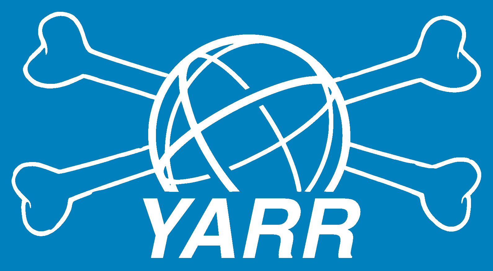

# YARR: Yet Another Rapid Readout

## Documentation

For details please refer to the documentation covering installation and usage, which can be found here http://cern.ch/yarr

This README only includes quick install guide.

(If you are working with the devel branch refer to http://cern.ch/yarr/devel/ and see the current coverage report at https://yarr.web.cern.ch/yarr/devel/coverage/)

## Mailing list

Users should subscribe to the CERN mailing list to receive announcements for important updates: [yarr-user](https://e-groups.cern.ch/e-groups/EgroupsSubscription.do?egroupName=yarr-users)

Developers and potential developers please refer to [Contribution](CONTRIBUTING.md) guide.

## Requirements

### Software:

- Alma 9
- cmake 3.14 or higher
- GCC version 11 or higher, C++20
- Some misc packages (can be installed via yum):
    - gnuplot, texlive-epstopdf (for built-in plotting)
    - boost-devel (for BDAQ)

## Quick minimal Install Guide:

- Builds spec and emu controller for mininmal dependencies on Centos 7
- Build recipes for other OS can be found in docker/<OS>/Dockerfile
- Clone from git
	- ``$ git clone https://gitlab.cern.ch/YARR/YARR.git Yarr``
- Compilation (default front-end and controller classes):
    - ``$ cd Yarr``
    - ``$ mkdir build & cd build``
    - ``$ cmake ..``
    - ``$ make -j12 install``
- Running
    - execute programs from the repository top folder like:
    - ``$ bin/scanConsole <...>``

### Building additional controllers

- In order to build with more controllers execute cmake with extra options
    - For all front-ends & controllers:
        - ``$ cmake -DYARR_FRONT_ENDS_TO_BUILD=all -DYARR_CONTROLLERS_TO_BUILD=all ..``
    - To add FELIX support:
        - ``$ cmake -DYARR_CONTROLLERS_TO_BUILD="Spec;Emu;FelixClient" ..``
    - List of all possible front-ends:
        - ``Fei4;Rd53a;Star;Rd53b;Itkpixv2``
    - List of all possible controllers:
        - ``Spec;Emu;StarEmu;Fei4Emu;Rd53aEmu;Itkpixv2Emu;Bdaq;FelixClient;ItsdaqFW``

While developing, it might be useful to run some unit tests. These are run
by default in the CI on gitlab, but can also be run locally:

- ``$ cd build``
- ``$ cmake -DBUILD_TESTS=on ..``
- ``$ make test``

This runs the test_main binary, which gathers the tests found in src/tests.
