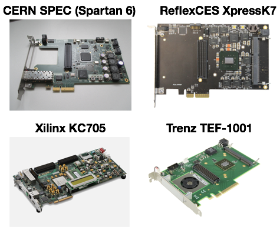

# PCIe FPGA card Installation and Setup

Two kinds of setups have to be distinguished, those that use Series 7 FPGAs and those that use the Spartan 6 based SPEC card. If in doubt see picture below:



## PCIe Kernel Driver

For both cards the custom PCIe kernel driver is required. It can be installed in the followin way:


## Spartan 6

For the Spartan 6 case it is required to have installed the software first. Then using the software the firmware is loaded into the board.
```bash
$ cd Yarr/src/kernel
$ make
<Lots of text>
$ sudo make install
<Copying files>
$ sudo depmod
<Builds dependencies>
$ sudo modprobe -v specDriver
insmod /lib/modules/3.10.0-229.14.1.el7.x86_64/extra/specDriver.ko
```


