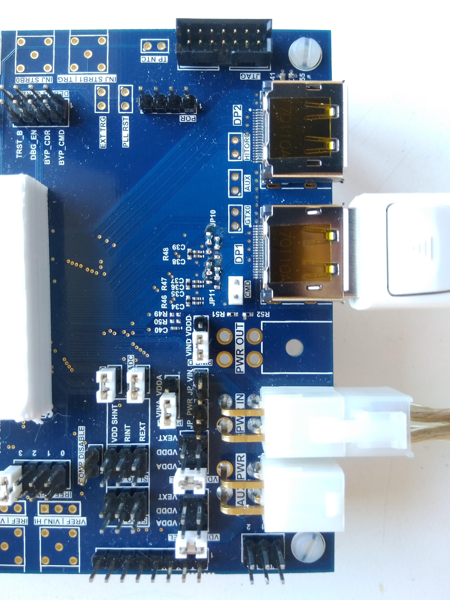

# RD53A

## RD53A testing with the Single Chip Card
More details about the SCC [Single Chip Card](https://twiki.cern.ch/twiki/bin/viewauth/RD53/RD53ATesting#RD53A_Single_Chip_Card_SCC)

### Jumper configuration and power on



Default settings for operation in **LDO mode**

- PWR_A and PWR_D: VINA and VIND (LDO operation)
- VDD_PLL_SEL: VDDA (PLL driver from VDDA supply)
- VDD_CML_SEL: VDDA (CML driver from VDDA supply)
- VREF_ADC (internal ADC voltage reference)
- IREF_IO (internal current refetrence)
- IREF_TRIM: Jumper to 3 to set the internal reference current at 4 μA
- Jumpers JP10 and JP11 should be closed in order to use LANE 2 and 3

**Make sure that the jumper configuration marked in red is correct before powering the chip!!! Applying too high voltage may kill the chip.**

After all jumpers are placed on the SCC, connect the DisplayPort cable to DP1 and power cable to PWR_IN.

Before powering the chip, run the script that turns off the command from the FPGA:
```
$ cd Yarr/src
$ ./bin/rd53a_PowerOn
void SpecCom::init() -> Opening SPEC with id #0
void SpecCom::init() -> Mapping BARs
void SpecCom::init() -> Mapped BAR0 at 0x0x7f8f0dcde000 with size 0x100000
void SpecCom::init() -> Mmap failed
void SpecCom::init() -> Could not map BAR4, this might be OK!
Now it is safe to turn on the power on the chip.
```

Set the power supply to <span style="color:red">**1.80**</span> V, the current should be around 0.41 A and power on the chip. For the LDO operation, e.g. the jumper configuration shown in previous figure, make sure <span style="color:red"> not to apply higher voltage than **1.80 V**</span>.

Check if the test program runs succesfully:
```
$ ./bin/rd53a_test
void SpecCom::init() -> Opening SPEC with id #0
void SpecCom::init() -> Mapping BARs
void SpecCom::init() -> Mapped BAR0 at 0x0x7fa5c8e0c000 with size 0x100000
void SpecCom::init() -> Mmap failed
void SpecCom::init() -> Could not map BAR4, this might be OK!
>>> Configuring chip with default config ...
... done.
>>> Checking link status: 0x1
All links are synced!
>>> Trigger test:
Trigger: 1
[Header] : L1ID(0) L1Tag(1) BCID(20616)
Trigger: 2
[Header] : L1ID(1) L1Tag(2) BCID(18489)
Trigger: 3
[Header] : L1ID(2) L1Tag(3) BCID(10360)
[Header] : L1ID(3) L1Tag(3) BCID(10361)
Trigger: 4
[Header] : L1ID(4) L1Tag(0) BCID(3634)
Trigger: 5
[Header] : L1ID(5) L1Tag(5) BCID(29688)
[Header] : L1ID(6) L1Tag(0) BCID(29690)
Trigger: 6
[Header] : L1ID(7) L1Tag(6) BCID(31433)
[Header] : L1ID(8) L1Tag(0) BCID(31434)
Trigger: 7
[Header] : L1ID(9) L1Tag(7) BCID(32464)
[Header] : L1ID(10) L1Tag(7) BCID(32465)
[Header] : L1ID(11) L1Tag(0) BCID(32466)
Trigger: 8
[Header] : L1ID(12) L1Tag(0) BCID(27067)
Trigger: 9
[Header] : L1ID(13) L1Tag(9) BCID(24960)
[Header] : L1ID(14) L1Tag(0) BCID(24963)
Trigger: 10
[Header] : L1ID(15) L1Tag(10) BCID(20377)
[Header] : L1ID(16) L1Tag(0) BCID(20379)
Trigger: 11
[Header] : L1ID(17) L1Tag(11) BCID(17424)
[Header] : L1ID(18) L1Tag(11) BCID(17425)
[Header] : L1ID(19) L1Tag(0) BCID(17427)
Trigger: 12
[Header] : L1ID(20) L1Tag(0) BCID(13546)
[Header] : L1ID(21) L1Tag(0) BCID(13547)
Trigger: 13
[Header] : L1ID(22) L1Tag(13) BCID(10592)
[Header] : L1ID(23) L1Tag(0) BCID(10594)
[Header] : L1ID(24) L1Tag(0) BCID(10595)
Trigger: 14
[Header] : L1ID(25) L1Tag(14) BCID(9657)
[Header] : L1ID(26) L1Tag(0) BCID(9658)
[Header] : L1ID(27) L1Tag(0) BCID(9659)
Trigger: 15
[Header] : L1ID(28) L1Tag(15) BCID(7352)
[Header] : L1ID(29) L1Tag(15) BCID(7353)
[Header] : L1ID(30) L1Tag(0) BCID(7354)
[Header] : L1ID(31) L1Tag(0) BCID(7355)
>>> Enabling digital injection
>>> Enabling some pixels
>>> Digital inject test:
[Header] : L1ID(0) L1Tag(4) BCID(14304)
[Header] : L1ID(1) L1Tag(4) BCID(14305)
[Header] : L1ID(2) L1Tag(8) BCID(14306)
[Header] : L1ID(3) L1Tag(8) BCID(14307)
[Header] : L1ID(4) L1Tag(8) BCID(14308)
[Data] : COL(12) ROW(0) PAR(1) TOT(15,11,15,11)
[Data] : COL(12) ROW(1) PAR(1) TOT(15,11,15,15)
[Header] : L1ID(5) L1Tag(8) BCID(14309)
[Header] : L1ID(6) L1Tag(0) BCID(14310)
[Header] : L1ID(7) L1Tag(0) BCID(14311)
```

### Proto Digital Scan
```
$ ./bin/rd53a_proto_digitalscan
>>> Configuring chip with default config ...
... done.
>>> Enabling digital injection
>>> Enabling some pixels
Enabled 2400 pixels
Mask = 0 , Col Loop = 0
Got 40800 hits
Mask = 0 , Col Loop = 4
Got 40800 hits
Mask = 0 , Col Loop = 8
Got 38400 hits
Enabled 2400 pixels
Mask = 1 , Col Loop = 0
Got 40800 hits
Mask = 1 , Col Loop = 4
Got 40800 hits
Mask = 1 , Col Loop = 8
Got 38400 hits
Enabled 2400 pixels
Mask = 2 , Col Loop = 0
Got 40800 hits
Mask = 2 , Col Loop = 4
Got 40800 hits
Mask = 2 , Col Loop = 8
Got 38400 hits
Enabled 2400 pixels
Mask = 3 , Col Loop = 0
<More Text>
```


### Proto Analog Scan
```
./bin/rd53a_proto_analogscan
void SpecCom::init() -> Opening SPEC with id #0
void SpecCom::init() -> Mapping BARs
void SpecCom::init() -> Mapped BAR0 at 0x0x7f060367a000 with size 0x100000
void SpecCom::init() -> Mmap failed
void SpecCom::init() -> Could not map BAR4, this might be OK!
>>> Configuring chip with default config ...
... done.
>>> Enabling digital injection
>>> Enabling some pixels
Enabled 2400 pixels
Mask = 0 , Col Loop = 0
Got 23999 hits
Mask = 0 , Col Loop = 4
Got 24000 hits
Mask = 0 , Col Loop = 8
Got 24000 hits
Mask = 0 , Col Loop = 12
Got 24000 hits
Mask = 0 , Col Loop = 16
Got 24000 hits
Enabled 2400 pixels
Mask = 1 , Col Loop = 0
Got 24000 hits
Mask = 1 , Col Loop = 4
Got 24000 hits
Mask = 1 , Col Loop = 8
Got 24000 hits
Mask = 1 , Col Loop = 12
Got 24000 hits
Mask = 1 , Col Loop = 16
Got 24000 hits
Enabled 2400 pixels
Mask = 2 , Col Loop = 0
Got 24000 hits
<More Text>
```


*The pattern in the differential FE is expected for the default configuration of Vff.*

### Loop Actions

List of available loop actions and their configuration parameters.

#### Rd53aTriggerLoop
Will repeatably send a 512-bit command from the burst buffer to the FE.

Config paramters:
    
- count <int>: number of injections, if 0 will run for specified time (default 50/100)
- delay <int>: time gap in bunch crossings between injection and trigger, should be divisible by 8 (default 56)
- extTrigger <bool>: enable external triggering, requires proper trigger processors configuration (default false)
- frequency <int>: trigger(/injection)frequency in Hz (default 5000)
- noInject <bool>: disable charge injection (e.g. for noise scan) (default false)
- time <int>: time in seconds, if count is set to 0 will run for this amount of time (default 0)
- edgeMode <bool>: switches cal injection command to edge mode, e.g. for digital scan (default false)

#### Rd53aCoreColLoop
Loops of core columns in specified pattern

Config parameters:
    
- max <int>: upper bound of cores to scan
- min <int>: lower bound of cores to scan
- step <int>: step size (1 will scan all cores, more than 1 will skip cores)
- nSteps <int>: how many steps should be used to scan over cores

#### Rd53aMaskLoop
Loops over pixels. All pixels in one core column are serialised on the following fashion.
    
```
...
==Core Col 2==
71  ..... 127
.   .....  .
66  ..... 121
65  ..... 120
64  ..... 119
==Core Col 1==
7   15  ..  63
6   14  ..  62
5   13  ..  61
4   12  ..  60
3   11  ..  59
2   10  ..  58
1   9   ..  57
0   8   ..  56
==Core Col 0==
```

The maximum of the loops defines how many pixels should be activated at one time. E.g. if the max is 64 that means every 64th pixel (1 pixel per core) and requires 64 steps to loop over all pixels.

Config parameters:
    
 - max <int>: number of mask stages
 - min <int>: mask stage to start with
 - step <int>: step size of mask stage
