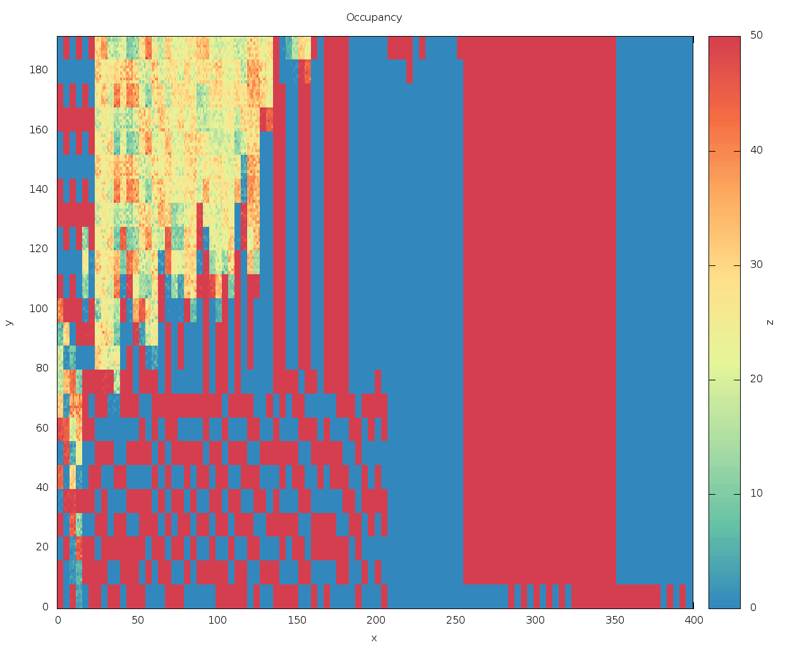

# RD53A

## RD53A testing with the Single Chip Card
More details about the SCC [Single Chip Card](https://twiki.cern.ch/twiki/bin/viewauth/RD53/RD53ATesting#RD53A_Single_Chip_Card_SCC)

### Jumper configuration and power on


Default settings for operation in LDO mode

- PWR_A and PWR_D: VINA and VIND (LDO operation)
- VDD_PLL_SEL: VDDA (PLL driver from VDDA supply)
- VDD_CML_SEL: VDDA (CML driver from VDDA supply)
- VREF_ADC (internal ADC voltage reference)
- IREF_IO (internal current refetrence)
- IREF_TRIM: Jumper to 3 to set the internal reference current at 4 μA
- Jumpers JP10 and JP11 should be closed in order to use LANE 2 and 3

**Make sure that the jumper configuration marked in red is correct before powering the chip!!! Applying too high voltage may kill the chip.**

After all jumpers are placed on the SCC, connect the DisplayPort cable to DP1 and power cable to PWR_IN.

Before powering the chip, run the script that turns off the command from the FPGA:
```
$ cd Yarr/src
$ ./bin/rd53a_PowerOn
void SpecCom::init() -> Opening SPEC with id #0
void SpecCom::init() -> Mapping BARs
void SpecCom::init() -> Mapped BAR0 at 0x0x7f8f0dcde000 with size 0x100000
void SpecCom::init() -> Mmap failed
void SpecCom::init() -> Could not map BAR4, this might be OK!
Now it is safe to turn on the power on the chip.
```

Set the power supply to <span style="color:red">**1.80**</span> V, the current should be around 0.41 A and power on the chip. For the LDO operation, e.g. the jumper configuration shown in previous figure, make sure to <span style="color:red"> not apply higher voltage than **1.80 V**</span>.

Check if the test program runs succesfully:
```
$ ./bin/rd53a_test
void SpecCom::init() -> Opening SPEC with id #0
void SpecCom::init() -> Mapping BARs
void SpecCom::init() -> Mapped BAR0 at 0x0x7f4b2c166000 with size 0x100000
void SpecCom::init() -> Mmap failed
void SpecCom::init() -> Could not map BAR4, this might be OK!
>>> Configuring chip with default config ...
... done.
>>> Trigger test:
Trigger: 1
[Header] : L1ID(24) L1Tag(1) BCID(27785)
[Header] : L1ID(18) L1Tag(19) BCID(19530)
[Data] : COL(62) ROW(13) PAR(0) TOT(8,11,13,0)
[Data] : COL(32) ROW(48) PAR(1) TOT(15,7,3,8)
[Data] : COL(5) ROW(51) PAR(0) TOT(1,3,13,1)
[Data] : COL(53) ROW(19) PAR(1) TOT(6,6,4,6)
[Header] : L1ID(7) L1Tag(24) BCID(7031)
[Header] : L1ID(29) L1Tag(16) BCID(23787)
[Header] : L1ID(16) L1Tag(0) BCID(7099)
<More Text>
```

### Digital Scan
```
$ ./bin/rd53a_proto_digitalscan
void SpecCom::init() -> Opening SPEC with id #0
void SpecCom::init() -> Mapping BARs
void SpecCom::init() -> Mapped BAR0 at 0x0x7fa7d4ce5000 with size 0x100000
void SpecCom::init() -> Mmap failed
void SpecCom::init() -> Could not map BAR4, this might be OK!
>>> Configuring chip with default config ...
... done.
>>> Enabling digital injection
>>> Enabling some pixels
Enabled 2400 pixels
Mask = 0 , Col Loop = 0
Got 1518 hits
Mask = 0 , Col Loop = 4
Got 10 hits
Mask = 0 , Col Loop = 8
Got 54 hits
Mask = 0 , Col Loop = 12
Got 175 hits
Mask = 0 , Col Loop = 16
Got 123 hits
Enabled 2400 pixels
Mask = 1 , Col Loop = 0
Got 1105 hits
Mask = 1 , Col Loop = 4
Got 295 hits
<More Text>
```



### Analog Scan
```
./bin/rd53a_proto_analogscan

<More Text>
```


### Scan Console
Coming soon!

