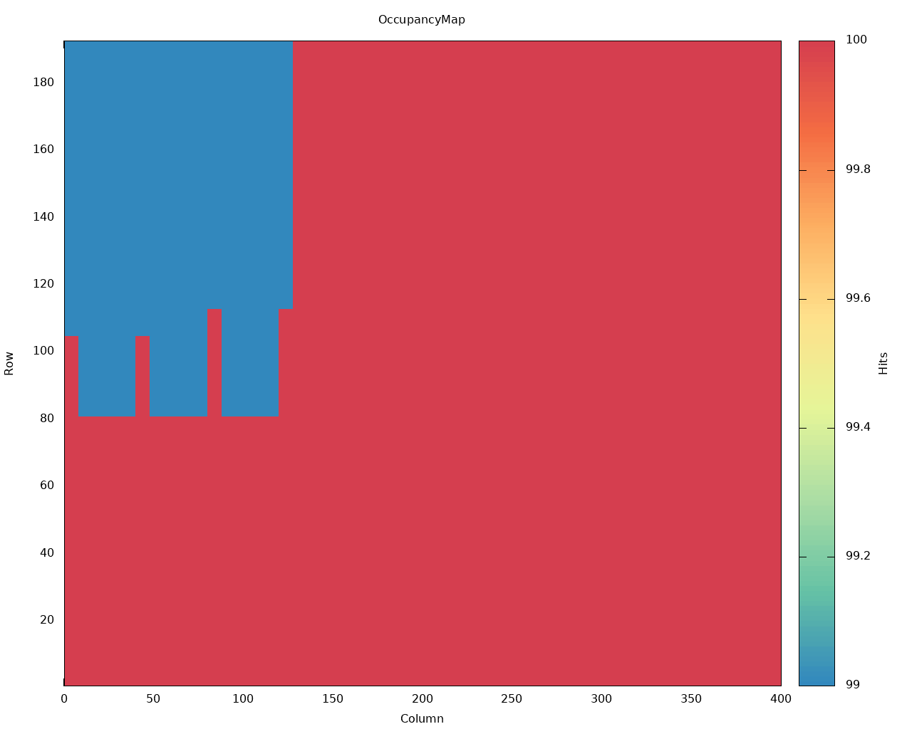

BDAQ is...

Go thru Software Inst and Running

# Software Installation

Adding BDAQ support to the Yarr software requires one extra dependency and enabling the ***BDAQ controller*** for compilation. To achieve this, follow the instructions ahead.

## Dependencies

1. Install the [typical Yarr software dependencies](install.md#dependencies)
1. Install the following extra dependency

```bash
$ sudo yum install boost-devel
```

## Get the appropriate software version

BDAQ support is either on the *devel* branch or on an *appropriate tag*.

```bash
$ git clone -b devel https://github.com/Yarr/Yarr.git Yarr
```

## Compile the software

```bash
$ cd Yarr/
$ mkdir build
$ cd build
$ cmake3 "-DYARR_CONTROLLERS_TO_BUILD=Spec;Emu;Bdaq" ../
$ make -j4
$ make install
```

# Running

Before running, check the following sections. If everything is already set, one can jump to the examples below. If running (no pun intended) into trouble, refer to:

Running with BDAQ controller should be the same as with any other hardware controller, just watch out for the hardware controller configuration file. Here are some examples:

## Digital scan

# Firmware

BDAQ controller works with the original BDAQ firmware. Below one can find links for the firmware bitstream (firmware building output) download, placed here for convenience. These links point to the official BDAQ repository. For more information, refer to: https://gitlab.cern.ch/silab/bdaq53/-/releases

- (**Recommended**) **v1.2**, 640 Mbps, 1-lane per chip: [1.2.0_BDAQ53_1LANE_RX640](https://gitlab.cern.ch/silab/bdaq53/uploads/936860f3e449cb8cd1a8fecc4f215318/1.2.0_BDAQ53_1LANE_RX640.tar.gz)
- **v1.2**, 1.28 Gbps, 1-lane per chip, [1.2.0_BDAQ53_1LANE_RX1280](https://gitlab.cern.ch/silab/bdaq53/uploads/f085eba35ff1760250f829c62147c8d7/1.2.0_BDAQ53_1LANE_RX1280.tar.gz)

## Firmware Installation
- Firmware installation instructions: https://gitlab.cern.ch/silab/bdaq53/-/wikis/Bdaq-firmware-manager

# Connectivity

When running [*scanConsole*](scanconsole.md), the [connectivity configuration file ](scanconsole.md#Command%20Line%20Arguments) must reflect your setup according to the mappings shown below:

For Module Testing connectivity hints, refer to: [Module Testing](Module%20Testing) in this document, as well as,

## Command Driver (transmitter) mapping

BDAQ has only one Command Driver, thus "tx" : 0 is always used.

| Software Identifier | DisplayPort |    BDAQ   |
|:-------------------:|:-----------:|:---------:|
|       "tx" : 0      |     DP 0    | CMD (AUX) |
|       "tx" : 0      |     DP 1    | CMD (AUX) |
|       "tx" : 0      |     DP 2    | CMD (AUX) |
|       "tx" : 0      |     DP 3    | CMD (AUX) |

## Aurora Receivers mapping

BDAQ has 7 Aurora receivers in total, 4 for Multi-lane DisplayPort (DP0), and 1 for each of the single-lane DisplayPorts (DP1, DP2 and DP3). The software identifier to the Aurora receiver mapping is as follows:

| Software Identifier | DisplayPort | BDAQ RX |
|:-------------------:|:-----------:|:-------:|
|       "rx" : 0      |     DP 0    |   RX 0  |
|       "rx" : 1      |     DP 0    |   RX 1  |
|       "rx" : 2      |     DP 0    |   RX 2  |
|       "rx" : 3      |     DP 0    |   RX 3  |
|       "rx" : 4      |     DP 1    |   RX 0  |
|       "rx" : 5      |     DP 2    |   RX 0  |
|       "rx" : 6      |     DP 3    |   RX 0  |

Refer to the figure below to identify the DisplayPort connectors in the BDAQ hardware.


# Trigger Frequency

When running with a single chip, the default trigger frequencies, set in the scan configuration files, should work out-of-the-box. However, when reading out **more than 1 chip**, at the same time, the **trigger frequency should be reduced**.

One possibility is to **divide** the trigger frequency **by the number of chips running**, e.g., for a threshold scan with a default 30 kHz trigger, set it to 15 kHz for 2-chip operation, or 7.5 kHz for 4-chip operation. Another possibility is just choosing a **reasonable value**, let's say **5 kHz**, as a default for any configuration.

The achievable trigger frequency is a function of the entire DAQ system ability to read-out chip data, without letting it overrun. The DAQ computer specifications, system load, network activity, etc will have an impact into this ability. If you are experiencing errors such as **"[ error  ][Rd53aDataProcessor]: [0] Received data not valid:"**, a too high trigger frequency setting is a potential culprit. If possible, **use a dedicated network interface for BDAQ**.

# Module Testing

## 1DP Adapter

With the [Osaka 1DP Adapter](https://gitlab.cern.ch/itk-pixel-hybrid/rd53a_testboard_japan/-/blob/master/1DP_Adapter_Board_V3.pdf), only ***DP 0*** of the BDAQ hardware can be used. The command driver and receivers mappings are shown in the tables below:

## Command Driver (transmitter) mapping

BDAQ has only one Command Driver, thus "tx" : 0 is always used.

| Software Identifier | DisplayPort |    BDAQ   |    1DP Adapter    |
|:-------------------:|:-----------:|:---------:|:-----------------:|
|       "tx" : 0      |     DP 0    | CMD (AUX) | Chip 1, CMD (AUX) |
|       "tx" : 0      |     DP 0    | CMD (AUX) | Chip 2, CMD (AUX) |
|       "tx" : 0      |     DP 0    | CMD (AUX) | Chip 3, CMD (AUX) |
|       "tx" : 0      |     DP 0    | CMD (AUX) | Chip 4, CMD (AUX) |

## Aurora Receivers mapping

| Software Identifier | DisplayPort | BDAQ RX |  1DP Adapter  |
|:-------------------:|:-----------:|:-------:|:-------------:|
|       "rx" : 0      |     DP 0    |   RX 0  | Chip 1, GTX 0 |
|       "rx" : 1      |     DP 0    |   RX 1  | Chip 2, GTX 0 |
|       "rx" : 2      |     DP 0    |   RX 2  | Chip 3, GTX 0 |
|       "rx" : 3      |     DP 0    |   RX 3  | Chip 4, GTX 0 |

### Sample connectivity configuration file for the 1DP Adapter:
```bash
{
    "chipType" : "RD53A",
    "chips" : [
        {
            "config" : "configs/chip1.json",
            "tx" : 0,
            "rx" : 0,
            "enable" : 1,
            "locked" : 0
        },
        {
            "config" : "configs/chip2.json",
            "tx" : 0,
            "rx" : 1,
            "enable" : 1,
            "locked" : 0
        },
        {
            "config" : "configs/chip3.json",
            "tx" : 0,
            "rx" : 2,
            "enable" : 1,
            "locked" : 0
        },
        {
            "config" : "configs/chip4.json",
            "tx" : 0,
            "rx" : 3,
            "enable" : 1,
            "locked" : 0
        }

    ]
}
```

## 4DP Adapter

A suggested setup is connecting ***DisplayPort 1***, ***DisplayPort 2***, ***DisplayPort 3*** and ***DisplayPort 4***, of the [Osaka 4DP Adapter](https://gitlab.cern.ch/itk-pixel-hybrid/rd53a_testboard_japan/-/blob/master/Adapter_Board_V3.pdf), respectively, to ***DP 0***, ***DP 1***, ***DP 2*** and ***DP 3*** of the BDAQ hardware. With this setup, the command driver and receivers mappings are as follows:

## Command Driver (transmitter) mapping

BDAQ has only one Command Driver, thus "tx" : 0 is always used.

| Software Identifier | DisplayPort |    BDAQ   |    1DP Adapter    |
|:-------------------:|:-----------:|:---------:|:-----------------:|
|       "tx" : 0      |     DP 0    | CMD (AUX) | Chip 1, CMD (AUX) |
|       "tx" : 0      |     DP 1    | CMD (AUX) | Chip 2, CMD (AUX) |
|       "tx" : 0      |     DP 2    | CMD (AUX) | Chip 3, CMD (AUX) |
|       "tx" : 0      |     DP 3    | CMD (AUX) | Chip 4, CMD (AUX) |

## Aurora Receivers mapping

| Software Identifier | DisplayPort | BDAQ RX |  4DP Adapter  |
|:-------------------:|:-----------:|:-------:|:-------------:|
|       "rx" : 0      |     DP 0    |   RX 0  | Chip 1, GTX 0 |
|       "rx" : 1      |     DP 0    |   RX 1  | Not supported |
|       "rx" : 2      |     DP 0    |   RX 2  | Not supported |
|       "rx" : 3      |     DP 0    |   RX 3  | Not connected |
|       "rx" : 4      |     DP 1    |   RX 0  | Chip 2, GTX 0 |
|       "rx" : 5      |     DP 2    |   RX 0  | Chip 3, GTX 0 |
|       "rx" : 6      |     DP 3    |   RX 0  | Chip 4, GTX 0 |

*The ***GTX 1***, ***GTX 2*** and ***GTX 3***, for all the Chips, are indeed not reachable.

### Sample connectivity configuration file for the 4DP Adapter:
```bash
{
    "chipType" : "RD53A",
    "chips" : [
        {
            "config" : "configs/chip1.json",
            "tx" : 0,
            "rx" : 0,
            "enable" : 1,
            "locked" : 0
        },
        {
            "config" : "configs/chip2.json",
            "tx" : 0,
            "rx" : 4,
            "enable" : 1,
            "locked" : 0
        },
        {
            "config" : "configs/chip3.json",
            "tx" : 0,
            "rx" : 5,
            "enable" : 1,
            "locked" : 0
        },
        {
            "config" : "configs/chip4.json",
            "tx" : 0,
            "rx" : 6,
            "enable" : 1,
            "locked" : 0
        }

    ]
}
```

# RD53A register configuration

To match the BDAQ hardware/firmware configuration, the RD53A Clock and Data Recovery (CDR) circuitry and the Aurora transmitters must be configured as follows:

- Set the following CDR register to
  
```
"CdrPdDel": 4
```

- Set Aurora transmitter to work with 1-lane, routed to GTX0 only
```
"CmlEn": 1
"OutputActiveLanes": 1
```

- For 640 Mbps operation (Aurora transfer rate), set:
```
"CdrSelSerClk": 1
```

- For 1.28 Gbps operation (Aurora transfer rate), set:
```
"CdrSelSerClk": 0
```

# BDAQ controller parameters (bdaqCfg.json)

Some parameters from BDAQ controller might be configured via the hardware controller configuration file, under ***configs/controller/bdaqCfg.json***. The table below shows a brief explanation of those parameters.

|   Parameter   | Default value |                                                                                                           Description                                                                                                           |
|:-------------:|:-------------:|:-------------------------------------------------------------------------------------------------------------------------------------------------------------------------------------------------------------------------------:|
|    "ipAddr"   | 192.168.10.12 |                                                                                                 FPGA Ethernet module IP address.                                                                                                |
|   "udpPort"   |      4660     |                                                                                                    Ethernet module UDP port.                                                                                                    |
|   "tcpPort"   |       24      |                                                                                                    Ethernet module TCP port.                                                                                                    |
|  "rxWaitTime" |       15      |                                                    Time, in milliseconds, that<br/> Data Loop waits before reading<br/> the last data block after a<br/> Mask Stage finishes.                                                   |
|  "softwareAZ" |      true     |                                                                Auto-Zero feature for<br/> Synchronous front-end.<br/> **true**: enabled<br/> **false**: disabled                                                                |
| "configSi570" |      true     | Configures the oscillator that<br/> generates the reference clock for<br/> chip CDR and Aurora receivers.<br/> **true**: frequency is set to 160 MHz<br/> **false**: oscillator is left with the factory<br/> frequency, 156.25 MHz |
|    "rxAddr"   |    "0x6000"   |                                                                                          FPGA Aurora receiver modules (first) address.                                                                                          |
|   "i2cAddr"   |    "0x1000"   |                                                                                                   FPGA i2c controller address.                                                                                                  |
|   "cmdAddr"   |    "0x9000"   |                                                                                             FPGA Command Driver controller address.                                                                                             |
| "controlAddr" |    "0x2100"   |                                                                                                  FPGA GPIO controller address.                                                                                                  |

# Troubleshooting

- No Aurora Synchronization
  - Confirm these [RD53A register settings](#rd53a-register-configuration)
  - Confirm proper settings for RD53A **"SldoAnalogTrim"** and **"SldoDigitalTrim"** registers
  - Disable the Si570 configuration by setting **"configSi570"** to **false**, [more details](#bdaq-controller-parameters-bdaqcfgjson)
<br>  
- Errors like: **[ error  ][Rd53aDataProcessor]: [0] Received data not valid:**
  - Confirm scan [trigger frequency settings](#trigger-frequency)
  - This is a [known issue](#known-issues) with noise scans
  - Confirm proper settings for RD53A **"SldoAnalogTrim"** and **"SldoDigitalTrim"** registers  
<br>  
- Hit patterns in digital scans
    
  

  - Increase **"rxWaitTime"**, **5 ms steps** seem reasonable. More information [here](#bdaq-controller-parameters-bdaqcfgjson)

# Known Issues

- Noise scans generate errors like: **[ error  ][Rd53aDataProcessor]: [0] Received data not valid:**
  - Hit (noise) data is unfortunately being lost
  - The resulting noise map will be an underestimation of the real noise
  - This issue is being investigated  
  
