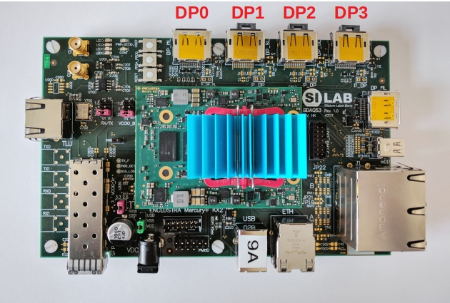

# Software Installation

Adding BDAQ support to the Yarr software requires one extra dependency and enabling the ***BDAQ controller*** for compilation. To achieve this, follow the instructions ahead.

## Dependencies

1. Install the [typical Yarr software dependencies](install.md#dependencies)
1. Install the following extra dependency

```bash
$ sudo yum install boost-devel
```

## Get the appropriate software version

BDAQ support is either on the *devel* branch or on an *appropriate tag*.

```bash
$ git clone -b devel https://github.com/Yarr/Yarr.git Yarr
```

## Compile the software

```bash
$ cd Yarr/
$ mkdir build
$ cd build
$ cmake3 "-DYARR_CONTROLLERS_TO_BUILD=Spec;Emu;Bdaq" ../
$ make -j4
$ make install
```

# Firmware

The BDAQ hardware must have one of the following firmwares deployed to its FPGA:

- **Recommended:** [1.2.0_BDAQ53_1LANE_RX640](https://gitlab.cern.ch/silab/bdaq53/uploads/936860f3e449cb8cd1a8fecc4f215318/1.2.0_BDAQ53_1LANE_RX640.tar.gz)
- [...](...)
- For more information, refer to: https://gitlab.cern.ch/silab/bdaq53/-/releases
- Firmware installation instructions: https://gitlab.cern.ch/silab/bdaq53/-/wikis/Bdaq-firmware-manager

# Connectivity

When running [*scanConsole*](scanconsole.md), the [connectivity configuration file ](scanconsole.md#Command%20Line%20Arguments) must reflect your setup, according to the mappings shown below:

## Command Driver (transmitter) mapping

BDAQ has only one Command Driver, always tx0...

| Software Identifier | DisplayPort |    BDAQ   |
|:-------------------:|:-----------:|:---------:|
|       "tx" : 0      |     DP 0    | CMD (AUX) |
|       "tx" : 0      |     DP 1    | CMD (AUX) |
|       "tx" : 0      |     DP 2    | CMD (AUX) |
|       "tx" : 0      |     DP 3    | CMD (AUX) |

## Aurora Receivers mapping

| Software Identifier | DisplayPort | BDAQ RX |
|:-------------------:|:-----------:|:-------:|
|       "rx" : 0      |     DP 0    |   RX 0  |
|       "rx" : 1      |     DP 0    |   RX 1  |
|       "rx" : 2      |     DP 0    |   RX 2  |
|       "rx" : 3      |     DP 0    |   RX 3  |
|       "rx" : 4      |     DP 1    |   RX 0  |
|       "rx" : 5      |     DP 2    |   RX 0  |
|       "rx" : 6      |     DP 3    |   RX 0  |

Refer to the figure below to identify the DisplayPort connectors in the BDAQ hardware.



# Running

Running with BDAQ controller should be the same as with any other hardware controller, just watch out for the controller configuration file. Here are some examples:

## Digital scan

# Trigger Frequency

When running with a single chip, the default trigger frequencies, set in the scan configuration files, should work normally. However, when reading out more than 1 chip, at the same time, the trigger frequency should be reduced.

One possibility is to divide the trigger frequency by the number of chips running, e.g., for a threshold scan with a default 30 kHz trigger, set it to 15 kHz for 2-chip operation, or 7.5 kHz for 4-chip operation.

The achievable trigger frequency is a function of the entire DAQ system ability to read-out chip data, without letting it overrun (with triggers). The DAQ computer specifications, system load, network activity, etc will have an impact into this ability. If you are experiencing errors such... a potential culprit is the trigger frequency.

# Module Testing

## 1DP Adapter

With the [Osaka 1DP Adapter](https://gitlab.cern.ch/itk-pixel-hybrid/rd53a_testboard_japan/-/blob/master/1DP_Adapter_Board_V3.pdf), only ***DP 0*** of the BDAQ hardware can be used. The command driver and receivers mappings are shown in the tables below:

## Command Driver (transmitter) mapping

| Software Identifier | Displayport |    BDAQ   |    1DP Adapter    |
|:-------------------:|:-----------:|:---------:|:-----------------:|
|       "tx" : 0      |     DP 0    | CMD (AUX) | Chip 1, CMD (AUX) |
|       "tx" : 0      |     DP 0    | CMD (AUX) | Chip 2, CMD (AUX) |
|       "tx" : 0      |     DP 0    | CMD (AUX) | Chip 3, CMD (AUX) |
|       "tx" : 0      |     DP 0    | CMD (AUX) | Chip 4, CMD (AUX) |

## Aurora Receivers mapping

| Software Identifier | DisplayPort | BDAQ RX |  1DP Adapter  |
|:-------------------:|:-----------:|:-------:|:-------------:|
|       "rx" : 0      |     DP 0    |   RX 0  | Chip 1, GTX 0 |
|       "rx" : 1      |     DP 0    |   RX 1  | Chip 2, GTX 0 |
|       "rx" : 2      |     DP 0    |   RX 2  | Chip 3, GTX 0 |
|       "rx" : 3      |     DP 0    |   RX 3  | Chip 4, GTX 0 |

### Sample connectivity configuration file for the 1DP Adapter:
```bash
{
    "chipType" : "RD53A",
    "chips" : [
        {
            "config" : "configs/chip1.json",
            "tx" : 0,
            "rx" : 0,
            "enable" : 1,
            "locked" : 0
        },
        {
            "config" : "configs/chip2.json",
            "tx" : 0,
            "rx" : 1,
            "enable" : 1,
            "locked" : 0
        },
        {
            "config" : "configs/chip3.json",
            "tx" : 0,
            "rx" : 2,
            "enable" : 1,
            "locked" : 0
        },
        {
            "config" : "configs/chip4.json",
            "tx" : 0,
            "rx" : 3,
            "enable" : 1,
            "locked" : 0
        }

    ]
}
```

## 4DP Adapter

A suggested setup is connecting ***DisplayPort 1***, ***DisplayPort 2***, ***DisplayPort 3*** and ***DisplayPort 4***, of the [Osaka 4DP Adapter](https://gitlab.cern.ch/itk-pixel-hybrid/rd53a_testboard_japan/-/blob/master/Adapter_Board_V3.pdf), respectively, to ***DP 0***, ***DP 1***, ***DP 2*** and ***DP 3*** of the BDAQ hardware. With this setup, the command driver and receivers mappings are as follows:

## Command Driver (transmitter) mapping

| Software Identifier | Displayport |    BDAQ   |    1DP Adapter    |
|:-------------------:|:-----------:|:---------:|:-----------------:|
|       "tx" : 0      |     DP 0    | CMD (AUX) | Chip 1, CMD (AUX) |
|       "tx" : 0      |     DP 1    | CMD (AUX) | Chip 2, CMD (AUX) |
|       "tx" : 0      |     DP 2    | CMD (AUX) | Chip 3, CMD (AUX) |
|       "tx" : 0      |     DP 3    | CMD (AUX) | Chip 4, CMD (AUX) |

## Aurora Receivers mapping

| Software Identifier | DisplayPort | BDAQ RX |  4DP Adapter  |
|:-------------------:|:-----------:|:-------:|:-------------:|
|       "rx" : 0      |     DP 0    |   RX 0  | Chip 1, GTX 0 |
|       "rx" : 1      |     DP 0    |   RX 1  | Not supported |
|       "rx" : 2      |     DP 0    |   RX 2  | Not supported |
|       "rx" : 3      |     DP 0    |   RX 3  | Not connected |
|       "rx" : 4      |     DP 1    |   RX 0  | Chip 2, GTX 0 |
|       "rx" : 5      |     DP 2    |   RX 0  | Chip 3, GTX 0 |
|       "rx" : 6      |     DP 3    |   RX 0  | Chip 4, GTX 0 |

*The ***GTX 1***, ***GTX 2*** and ***GTX 3***, for all the Chips, are indeed not reachable.

### Sample connectivity configuration file for the 4DP Adapter:
```bash
{
    "chipType" : "RD53A",
    "chips" : [
        {
            "config" : "configs/chip1.json",
            "tx" : 0,
            "rx" : 0,
            "enable" : 1,
            "locked" : 0
        },
        {
            "config" : "configs/chip2.json",
            "tx" : 0,
            "rx" : 4,
            "enable" : 1,
            "locked" : 0
        },
        {
            "config" : "configs/chip3.json",
            "tx" : 0,
            "rx" : 5,
            "enable" : 1,
            "locked" : 0
        },
        {
            "config" : "configs/chip4.json",
            "tx" : 0,
            "rx" : 6,
            "enable" : 1,
            "locked" : 0
        }

    ]
}
```

# RD53A register configuration
...

# BDAQ controller parameters (bdaqCfg.json)
...

# Troubleshooting

- No Aurora Synchronization
- Invalid Data

# Known Issues

- Noise Scans
  
