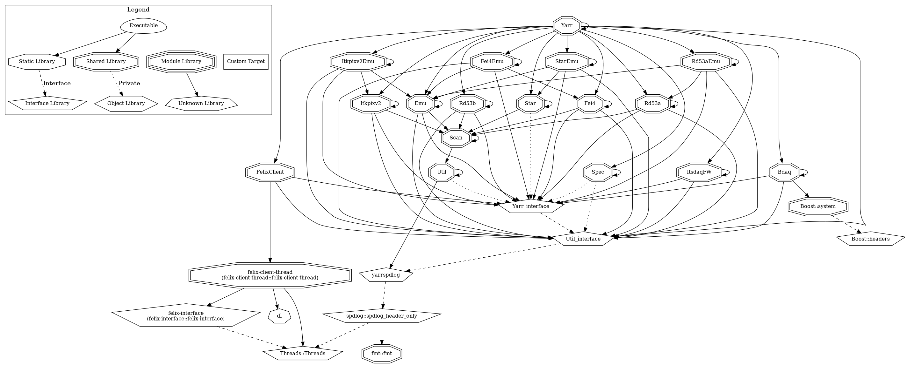

# CMake Compatibility

Yarr is a fully CMake-compatible project.  It tries to follow modern CMake best practices:

- Targets are defined using target_* commands.

- Namespaced targets (Yarr::) are provided.

- Configuration files (YarrConfig.cmake) are generated for easy find_package() usage.

- Installation exports a complete CMake package.

- Relative RPATH is configured for correct runtime library lookup after installation.

Supported minimum CMake version: 3.14.
# Installation

Here a short summary of the installation with a focus on installation as a dependency. Yarr can be installed into a separate directory from the build directory by setting the standard CMAKE_INSTALL_PREFIX during configuration:

```
cmake -S /path/to/yarr -B /path/to/build -DCMAKE_INSTALL_PREFIX=/desired/install/path

cmake --build /path/to/build

cmake --install /path/to/build
```

The install will place:

- Libraries into ${CMAKE_INSTALL_LIBDIR} (e.g., lib or lib64)

- Headers into ${CMAKE_INSTALL_INCLUDEDIR}

- CMake package config files into ${CMAKE_INSTALL_PREFIX}/cmake

Default if no install path is set is an in-source install. Yarr will try to avoid overwriting files which are under git control ie not all parts will be installed. If Yarr is added with add_subdirectory (or FetchContent) to a parent project then by default the parent project install path will be used for installation. This behaviour can be overriden by setting YARR_FORCE_OWN_INSTALL_PREFIX to true (install in own source directory even if a sub build was detected).
    
By default C++17 will be used but another version can be set and forced by (e.g.):

```
-DCMAKE_CXX_STANDARD=17
```

# How to consume Yarr as a dependency

Yarr supports several consumption methods which should cover most of the standard ways. Everything that is optional to be compiled is organized in form of components which are described in the bottom. In the following examples only random components are chosen.

## find_package()

After (separate) installation one can consume Yarr using:

```
find_package(Yarr REQUIRED COMPONENTS Spec Util)

target_link_libraries(MyTarget PRIVATE Yarr::Yarr Yarr::Spec Yarr::Util)
```

One must set CMAKE_PREFIX_PATH or Yarr_DIR if CMake cannot automatically find it:

```
cmake -DYarr_DIR=/path/to/install/cmake ...
```

## add_subdirectory()

If one wants to embed Yarr directly as a subproject (for development or tight coupling), it can be added via:

```
add_subdirectory(/path/to/yarr)
target_link_libraries(MyTarget PRIVATE Yarr::Yarr Yarr::Spec Yarr::Util)
```

No installation is needed in this case. All targets get automatically exposed to the parent project and be default all of the parent project will be applied.

## FetchContent

One can also use FetchContent to fetch Yarr at configure time:

```
include(FetchContent)

FetchContent_Declare(
  Yarr
  SOURCE_DIR /path/to/local/yarr # or GIT_REPOSITORY https://gitlab.cern.ch/YARR/YARR.git
  # for further options check the cmake manual
)

FetchContent_MakeAvailable(Yarr)

target_link_libraries(MyTarget PRIVATE Yarr::Yarr Yarr::Spec Yarr::Util)
```

FetchContent does not perform a full installation step — Yarr becomes part of the parent project’s build tree and all targets get exposed.

## Binary config

You can provide a binary configuration tag to install output targets in a tdaq-like
structure.

```
set(YARR_INSTALL_BIN_CONFIG "${BINARY_TAG}" CACHE INTERNAL "Pass config to YARR")
FetchContent_Declare(
  yarr
  ...
)
```

This includes installing debug info in `$TAG/lib/.debug/libName.so.debug`.

## ExternalProject_Add

One can also use the older ExternalProject_Add which can be useful for a super build approach. I.e. 

```
ExternalProject_Add(Yarr
  SOURCE_DIR /path/to/local/yarr # or GIT_REPOSITORY https://gitlab.cern.ch/YARR/YARR.git
  CMAKE_ARGS
    -DCMAKE_INSTALL_PREFIX=${YARR_INSTALL_DIR}
    -DCMAKE_BUILD_TYPE=${CMAKE_BUILD_TYPE}
  INSTALL_COMMAND ${CMAKE_COMMAND} --install . --prefix ${YARR_INSTALL_DIR}
)
```

In this case the installation is isolated and one has to use find_package or inject directly the directories. For an example of the super build architecture have a look at the external_project_superbuild test.

# Exported Targets and Components

The following CMake targets are exported by Yarr (executables not listed; fully printed during cmake execution):

| Name space | Target              | Type                       | Comments                                                     | Component   |
|------------|---------------------|----------------------------|--------------------------------------------------------------|-------------|
| Yarr::     | Scan                | dynamic library            |                                                              |             |
| Yarr::     | Util                | dynamic library            |                                                              |             |
| Yarr::     | Util_interface      | interface library          | target exposing only Util headers used for cyclic dependency |             |
| Yarr::     | Yarr                | dynamic library            |                                                              |             |
| Yarr::     | Yarr_interface      | interface library          | target exposing only Yarr headers used for cyclic dependency |             |
| Yarr::     | Bdaq                | dynamic library            |                                                              | Bdaq        |
| Yarr::     | Emu                 | dynamic library            |                                                              | Emu         |
| Yarr::     | FelixClient         | dynamic library            |                                                              | FelixClient |
| Yarr::     | Spec                | dynamic library            |                                                              | Spec        |
| Yarr::     | Fei4                | dynamic library            |                                                              | Fei4        |
| Yarr::     | Fei4Emu             | dynamic library            |                                                              | Fei4Emu     |
| Yarr::     | Itkpixv2            | dynamic library            |                                                              | Itkpixv2    |
| Yarr::     | Itkpixv2Emu         | dynamic library            |                                                              | Itkpixv2Emu |
| Yarr::     | ItsdaqFW            | dynamic library            |                                                              | ItsdaqFW    |
| Yarr::     | Rd53a               | dynamic library            |                                                              | Rd53a       |
| Yarr::     | Rd53aEmu            | dynamic library            |                                                              | Rd53aEmu    |
| Yarr::     | Rd53b               | dynamic library            |                                                              | Rd53b       |
| Yarr::     | Star                | dynamic library            |                                                              | Star        |
| Yarr::     | StarEmu             | dynamic library            |                                                              | StarEmu     |
| Yarr::     | _pyyarr             | dynamic library            |                                                              |             |
|            | felix-interface     | imported interface library | needed for FelixCLient                                       |             |
|            | felix-client-thread | imported dynamic library   | needed for FelixClient                                       |             |
| felix-interface::    | felix-interface     | imported interface library | only for FELIX client backends using felix-interface         |   |
| felix-client-thread::    | felix-client-thread | imported shared library    | only for FELIX client backends using felix-client-thread |   |
| tdaq::     | felix_interface     | imported interface target            | only for FELIX client backends using TDAQ proxy              |             |
| tdaq::     | felix_proxy         | imported imported target            | only for FELIX client backends using TDAQ proxy              |             |
|            | pybind11_headers    | imported interface library | only if python bindings are enabled                          |             |
|            | yarrspdlog          | imported interface library | needed by Yarr                                               |             |

These are organized into CMake components, so one can selectively request them using find_package(Yarr COMPONENTS ...).

This is the dependency graph:


Dependency graph created by:

- cmake --graphviz=yarr_lib_dependency.dot ..
- dot -Tpng -o yarr_lib_dependency.png yarr_lib_dependency.dot

# Options and Dependencies
## YARR general
YARR is using currently a patched spdlog version. It defines an own target ALIAS called yarrspdlog. If a target spdlog::spdlog is already available due to being integrated in another project it will be used. Otherwise it will an installed version unless the variable "YARR_FORCE_FETCHCONTENT_SPDLOG" is set to true. As the last resort the patched version is installed. Both the yarrspdlog ALIAS as well as the real target SPDLOG::SPDLOG in case YARR install it on its own are provided to downstream users.
## Python
If the python bindings are enabled by "YARR_ENABLE_PYTHON" pybind11 is downloaded and added to the YARR project making it directly available. Installation is called by the internal function "YARR_ADD_PYBIND11()".
## BDAQ
BDAQ requires the BOOST::system library.
## FelixClient
`FelixClient` is optional and is only built if this controller has been selected and at least one supported FELIX backend is available.

The backend selection is resolved internally by `YARR_ADD_FELIX_CLIENT()` in the following order:

1. **TDAQ proxy backend** 
   If the target `tdaq::felix_proxy` is already available, Yarr uses the TDAQ FELIX proxy backend.

2. **System FELIX client backend** 
   If `USE_SYSTEM_FELIX` is enabled, Yarr looks for a pre-installed FELIX package via `find_package(Felix ...)`, typically using `Felix_ROOT`.

3. **Embedded/self-built FELIX client backend** 
   Otherwise Yarr fetches and builds `felix-interface` and `felix-client-thread` via `FetchContent`.

The resolved backend is exposed internally through `YARR_FELIX_BACKEND`, currently one of:

- `FELIX_PROXY`
- `FELIX_CLIENT_SYSTEM`
- `FELIX_CLIENT_EMBEDDED`
- `NONE`

Downstream projects should normally link only against `Yarr::FelixClient`. They should not rely on a specific backend unless they intentionally want to integrate with the backend directly.

Depending on the selected backend, the following additional imported targets may be present (but not deliberately re-exported):

- `tdaq::felix_proxy`
- `tdaq::felix_interface`
- `felix-interface::felix-interface`
- `felix-client-thread::felix-client-thread`

These backend targets are implementation details of the `FelixClient` component and may differ between build environments.

Depending on the selected backend, Yarr::FelixClient may internally rely on backend-specific dependency targets such as tdaq::felix_proxy, felix::felix-interface, or felix::felix-client-thread. In add_subdirectory() or FetchContent() based integrations, and in some installed-package setups, these targets may also be visible to downstream CMake code, but they are not part of the stable Yarr public interface.
