# RD53A emulator

## Usage

Assuming the user has installed the software following instructions in install.md, now go to "build" folder.

To run digital scan, do
```
bin/scanConsole -r configs/controller/emuCfg_rd53a.json -c configs/connectivity/example_rd53a_setup.json -s configs/scans/rd53a/std_digitalscan.json -p
```
To run analog scan, do
```
bin/scanConsole -r configs/controller/emuCfg_rd53a.json -c configs/connectivity/example_rd53a_setup.json -s configs/scans/rd53a/std_analogscan.json -p
```
The results obtained from these two scans look like the following
<figure class="image">
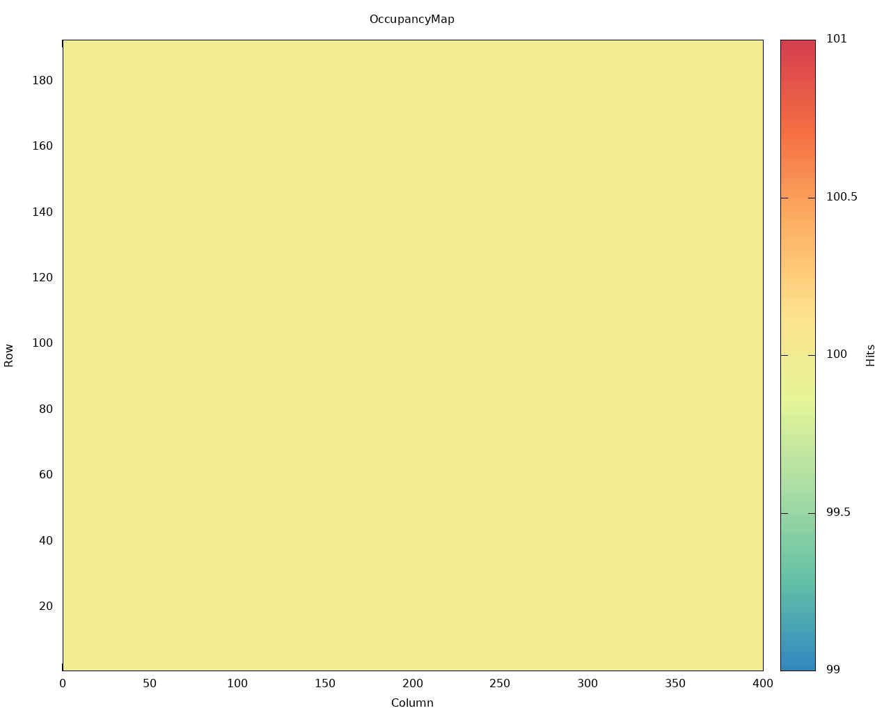

<figcaption>Digital (left) and analog (right) scan results in the RD53A emulator.</figcaption>
</figure>

Now move on to tune the "chip". The emulator is the idealization of the real hardware and does not contain the features in the physical chip. The tuning procedure is therefore simplier compared with the one detailed in rd53a.md. We could first tune the global thresholds to 1000e for all the three front-ends with the following commands.
```
bin/scanConsole -r configs/controller/emuCfg_rd53a.json -c configs/connectivity/example_rd53a_setup.json -s configs/scans/rd53a/syn_tune_globalthreshold.json -p -t 1000
bin/scanConsole -r configs/controller/emuCfg_rd53a.json -c configs/connectivity/example_rd53a_setup.json -s configs/scans/rd53a/lin_tune_globalthreshold.json -p -t 1000
bin/scanConsole -r configs/controller/emuCfg_rd53a.json -c configs/connectivity/example_rd53a_setup.json -s configs/scans/rd53a/diff_tune_globalthreshold.json -p -t 1000
```
After the tuning one should see the occupancy distribution centered around 50% like the following:
<figure class="image">
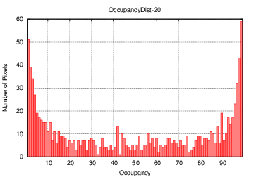
<figcaption>Result of global threshold tuning for linear front-end in the RD53A emulator.</figcaption>
</figure>

Now we can tune the pixel threshold. Run the following commands for linear and differential front-ends (N.B. for sync front-end this step is not needed):
```
bin/scanConsole -r configs/controller/emuCfg_rd53a.json -c configs/connectivity/example_rd53a_setup.json -s configs/scans/rd53a/lin_tune_pixelthreshold.json -p -t 1000
bin/scanConsole -r configs/controller/emuCfg_rd53a.json -c configs/connectivity/example_rd53a_setup.json -s configs/scans/rd53a/diff_tune_pixelthreshold.json -p -t 1000
```
This time we should see the occupancy distribution further concentrated around 50% like the following:
<figure class="image">
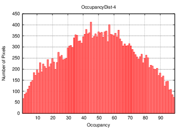
<figcaption>Result of pixel threshold tuning for linear front-end in the RD53A emulator.</figcaption>
</figure>

Finally let us run a threshold scan to check the tuning results:
```
bin/scanConsole -r configs/controller/emuCfg_rd53a.json -c configs/connectivity/example_rd53a_setup.json -s configs/scans/rd53a/std_thresholdscan.json -p
```
The threshold and noise distributions will look like following if everything is working fine:
<figure class="image">
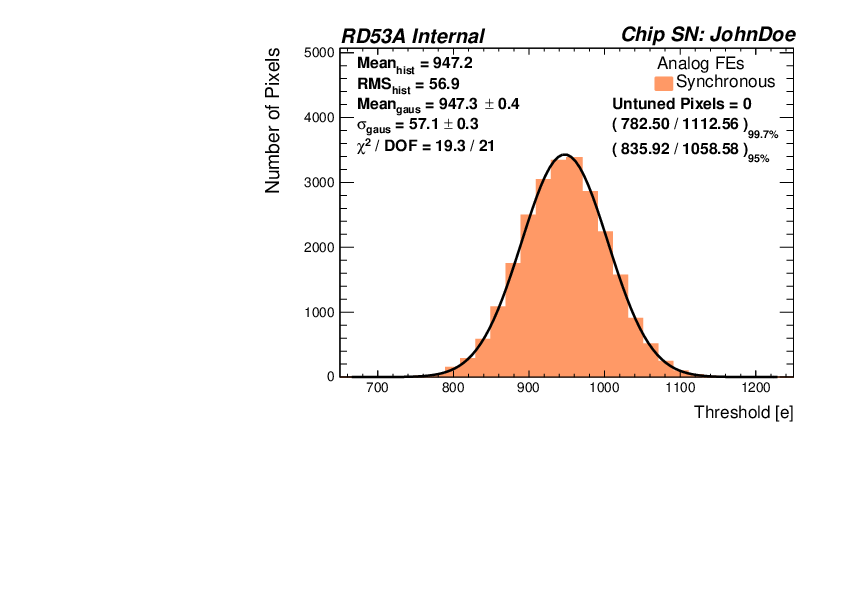
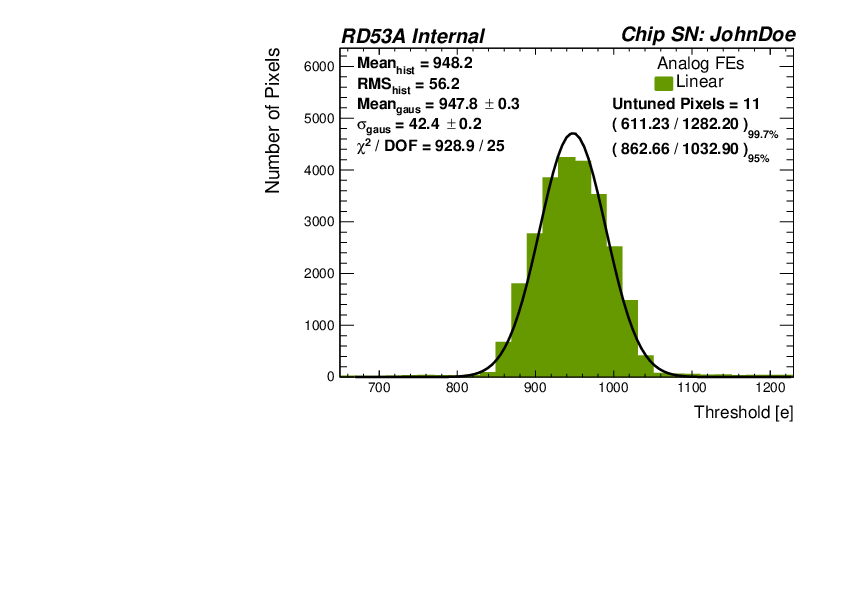
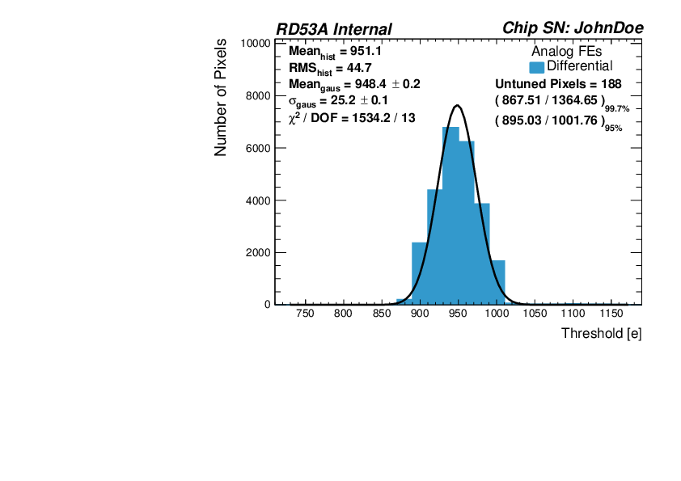
<figcaption>Threshold distributions for sync, linear, and differential front-ends.</figcaption>
</figure>
<figure class="image">
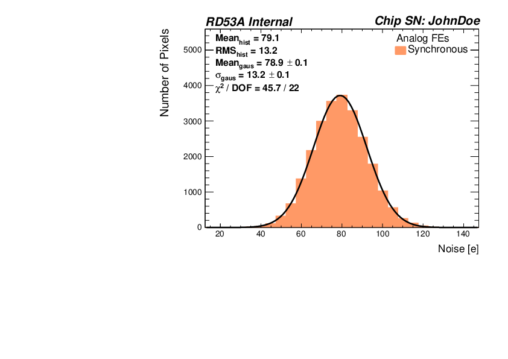
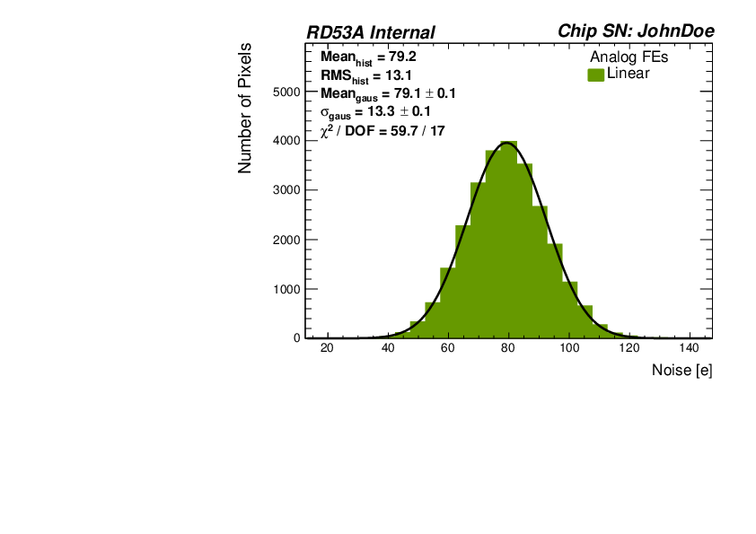
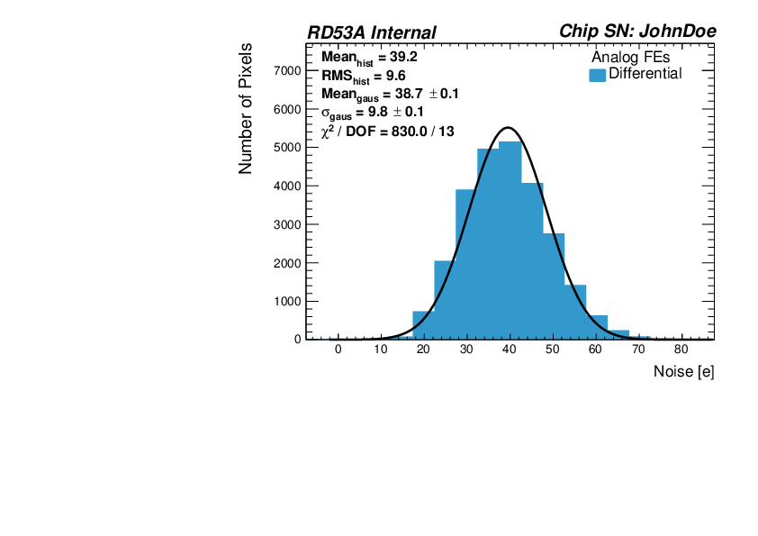
<figcaption>Noise distributions for sync, linear, and differential front-ends.</figcaption>
</figure>

## Input parameters
RD53A emulator has been implemented based on following measurements performed on real chips. The parameterizations implemented in the software emulator are summarized in the table below, and more details are provided in the following sections.

| Description | Parameterization |
| --- | --- |
| Vth -> threshold [e] | <ul><li>Sync: -175.807 + 9.13438 ⨉ SyncVth$$</li><li>Lin: -12827.1 + 39.298 ⨉ LinVth</li><li>Diff: 335.111 + 4.73165 ⨉ (DiffVth1-DiffVth2)</li></ul> |
| Threshold dispersion [Vth] | Sync: 5, Lin: 3, Diff: 20 |
| TDAC correction to threshold [Vth] | <ul><li>Sync: N/A </li><li>Lin: 3 ⨉ (TDAC - 8)</li><li>Diff: 15 ⨉ TDAC</li></ul> |
| Noise [e] | Mean Sync/Lin: 80, Diff: 40. Sigma=10 for all FEs |
| ToT [bc] vs. extra charge above threshold [10ke] | <ul><li>Sync: 1.21539 + 7.61735 ⨉ charge</li><li>Lin: 1.51625 + 7.29853 ⨉ charge</li><li>Diff: 4.56053 + 4.04173 ⨉ charge</li></ul> |

### Vth vs. threshold
The measurement is performed by first tuning the chip to a series of target thresholds following the procedure detailed in rd53a.md, and then plot the mean of the threshold distribution from a Gaussian fit as function of Vth values (the sigma of the Gaussian is included as error bar) for each front-end. The results are summarized in the following plots for three front-ends. Each case the data can be fitted well with a straight line.
These linear functions are implemented in the emulator to map the target threshold in electron charges into Vth.

<figure class="image">
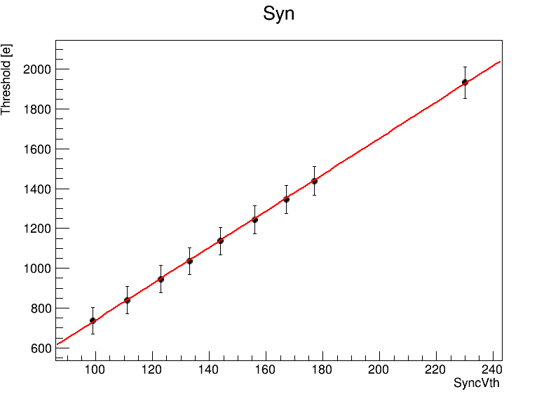
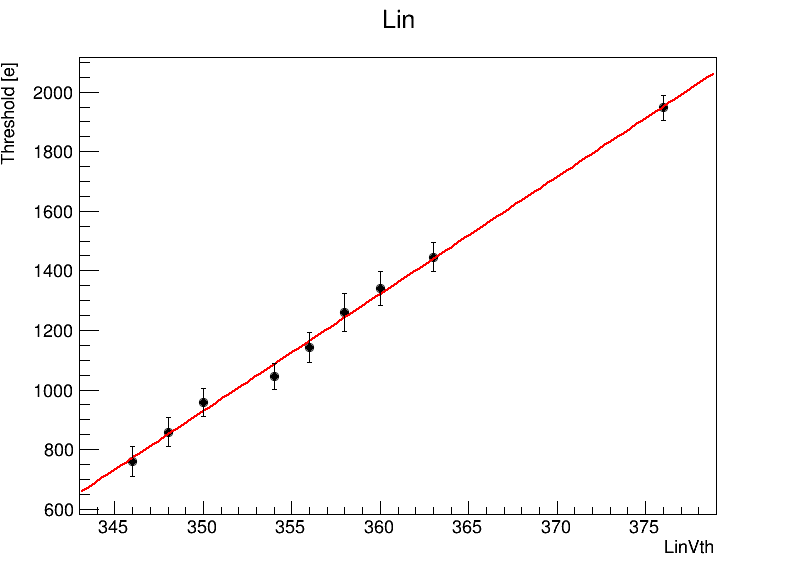
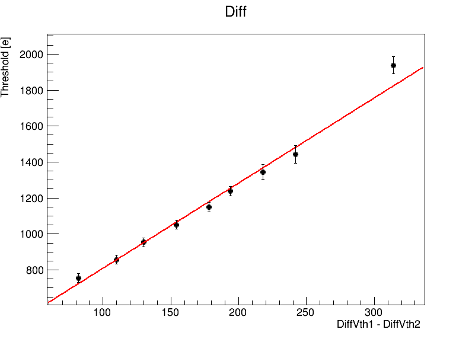
<figcaption>Threshold vs. Vth for sync, linear, and differential front-ends</figcaption>
</figure>

### Untuned pixel threshold dispersion
The untuned pixel thresholds on the chip have a dispersion. The dispersion is quantified using the real chip at different Vth values, with other global registers as well as pixel registers at default values. The obtained threshold distribution is first translated from electron charges to Vth using the linear function derived in previous section. Then it is divided by the corresponding Vth value of the front-end.
The distribution obtained can then be fitted with a Gaussian pdf. Both the mean and the sigma of the Gaussian are roughly constants as function of Vth as shown by plots below. In particular, the mean value divided by Vth is compatible with unity. The residual trends are not important to emulate.

<figure class="image">
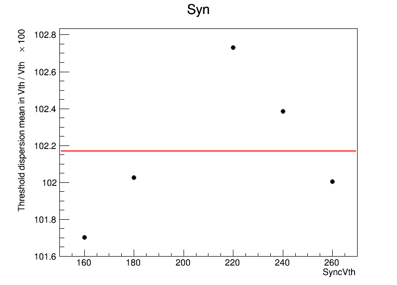
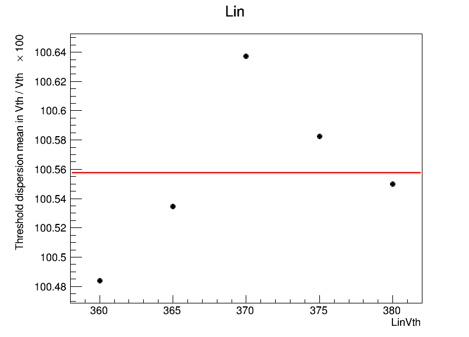
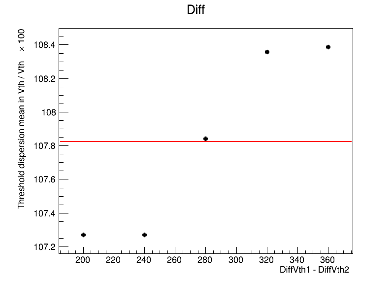
<figcaption>Mean of threshold distribution divided by Vth vs. Vth for sync, linear, and differential front-ends</figcaption>
</figure>

<figure class="image">
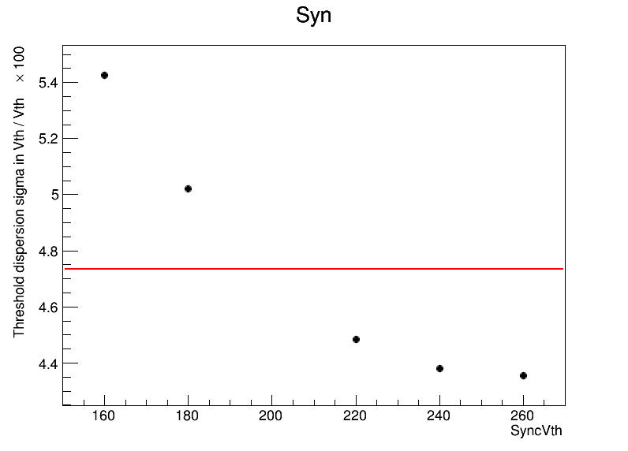
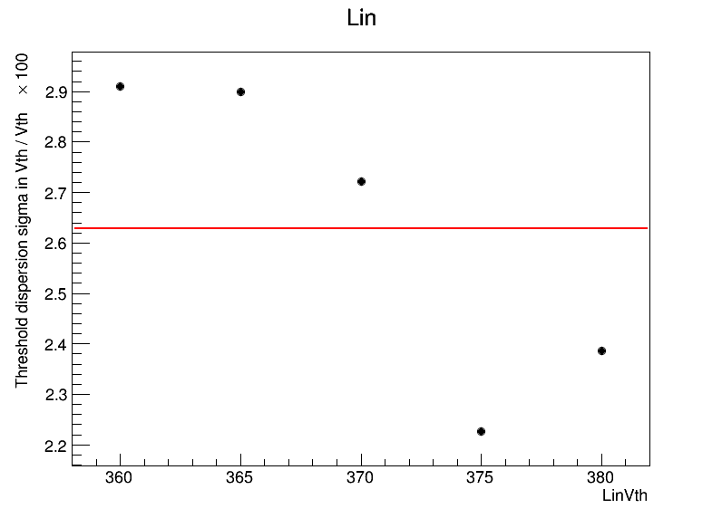
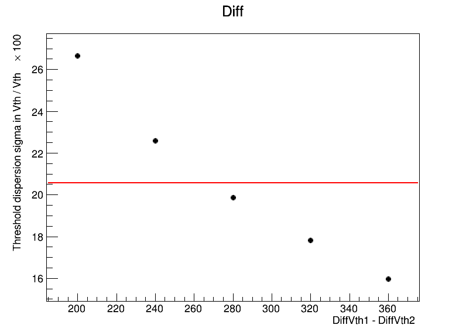
<figcaption>Sigma of threshold distribution divided by Vth vs. Vth for sync, linear, and differential front-ends</figcaption>
</figure>

### Pixel TDAC vs. threshold
Instead of characterizing TDAC response using the real chip, here a simplified approach is taken: a simple linear transformation of TDAC is added to the smeared threshold value. The coefficients of the linear function is tuned to roughly reproduce the observed resolution of threshold distribution after tuning.

### Pixel noise
The pixel noise is evaluated using the same threshold scans used to study threshold dispersion as discussed above. The mean and sigma of the width of the noise distribution are roughly constants as function of Vth as shown in plots below.

<figure class="image">
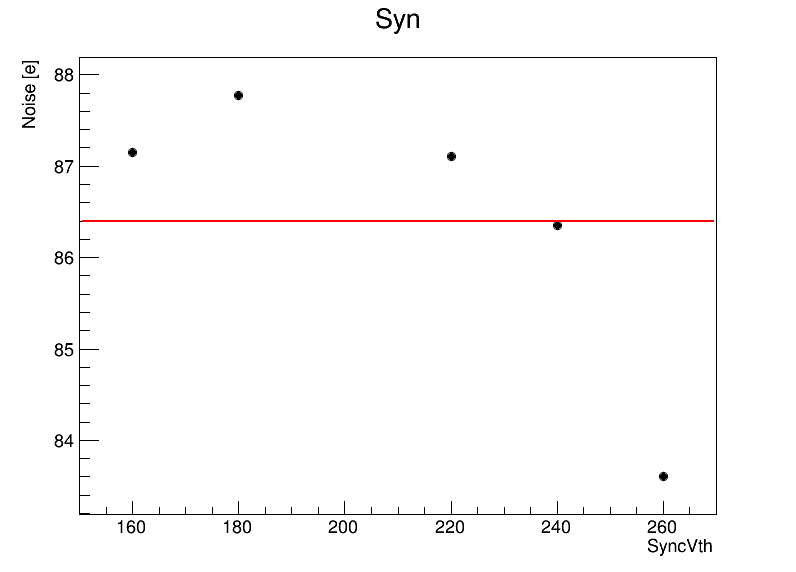
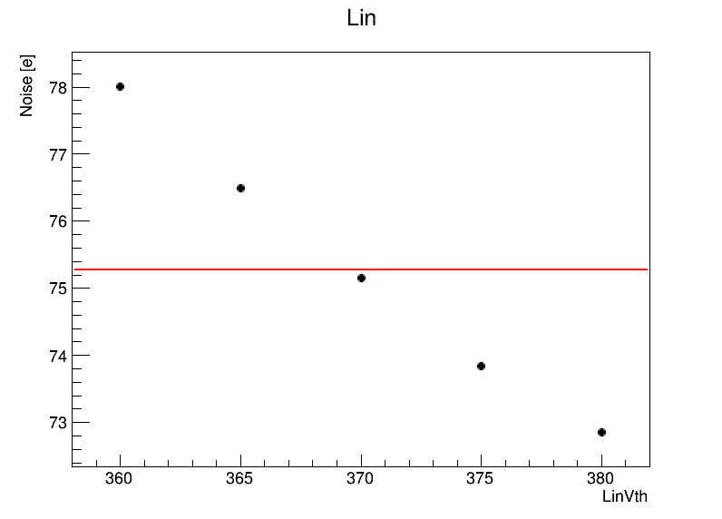
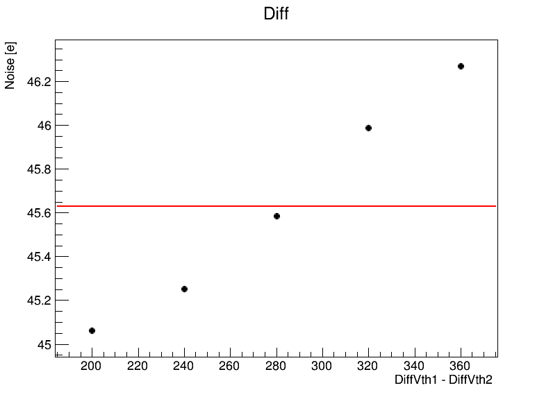
<figcaption>Mean of width of noise vs. Vth for sync, linear, and differential front-ends</figcaption>
</figure>

<figure class="image">
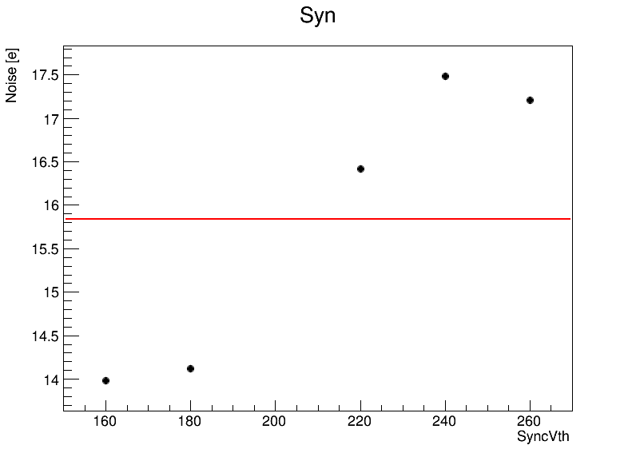
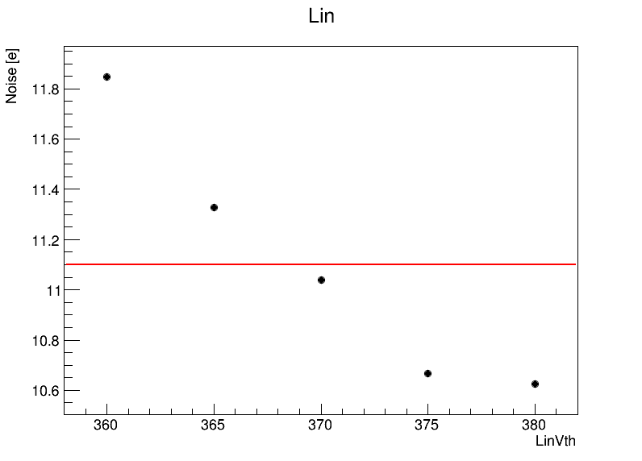
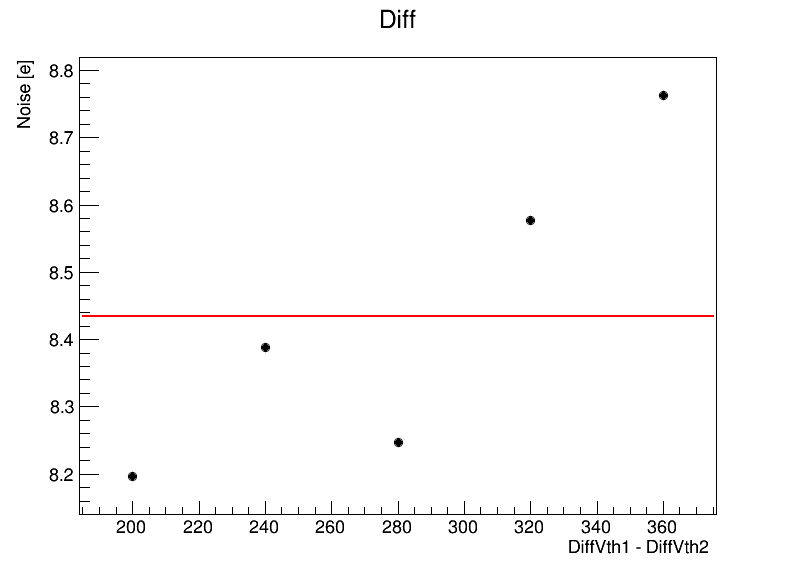
<figcaption>Sigma of width of noise vs. Vth for sync, linear, and differential front-ends</figcaption>
</figure>

### Time-over-threshold (ToT) vs. extra charge above threshold
The pixel ToT as function of extra charge above threshold is studied in the following steps. First, the chip is tuned to 1000e threshold, with ToT=8 bc at 10ke. Then the ToT is measured at different injection charges, ranging from 8ke to 12ke. Subtracting out the threshold (1ke), the results are summarized in the following plots. A linear function is good enough to model the data in each case.

<figure class="image">
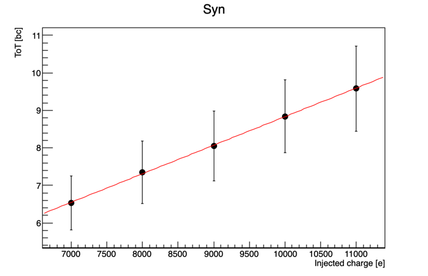
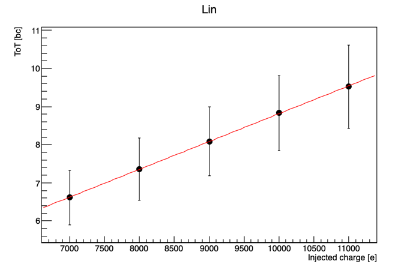
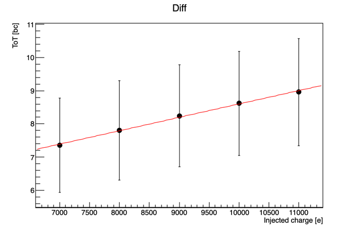
<figcaption>ToT vs. extra charge above threshold for sync, linear, and differential front-ends</figcaption>
</figure>

# RD53B emulator
Does not exist yet.