# RD53C / ITkPixV2 emulator

ITkPixV2 emulator covers range of the real chip functionality. From the DAQ perspective, there's no difference between the two. The emulator receives commands and sends outputs via a virtual controller. Internally, it holds a full SW representation of the chip registers, an encoder and command interpreter. Currently supported functionality includes
- All flavours of register writing
    - Single write in global registers
    - Single / multiple write in pixel registers, including row-auto increase
    - Core column broadcasting
- Register reading
    - Single-register read
- Calibration charge injection
    - Digital / analog response to Cal command
- Triggering

With the functionality above, one can run digital, analog and threshold scans as well as full threshold tuning.

## Quickstart

All scans can be run through scanConsole, using the usual scan configurations and the emulator's controller under configs/controller/emuCfg_itkpixv2.json, e. g.:

```
./bin/scanConsole -r configs/controller/emuCfg_itkpixv2.json -c configs/connectivity/example_itkpixv2_setup.json -s configs/scans/itkpixv2/std_digitalscan.json -p
```
for a digital scan, or
```
./bin/scanConsole -r configs/controller/emuCfg_itkpixv2.json -c configs/connectivity/example_itkpixv2_setup.json -s configs/scans/itkpixv2/std_digitalscan.json -p
```
for an analog scan. Example outputs of mean ToT maps for the digital and analog scans are shown below.

<figure class="image">
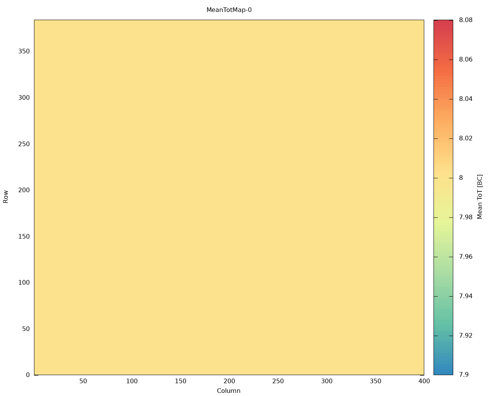
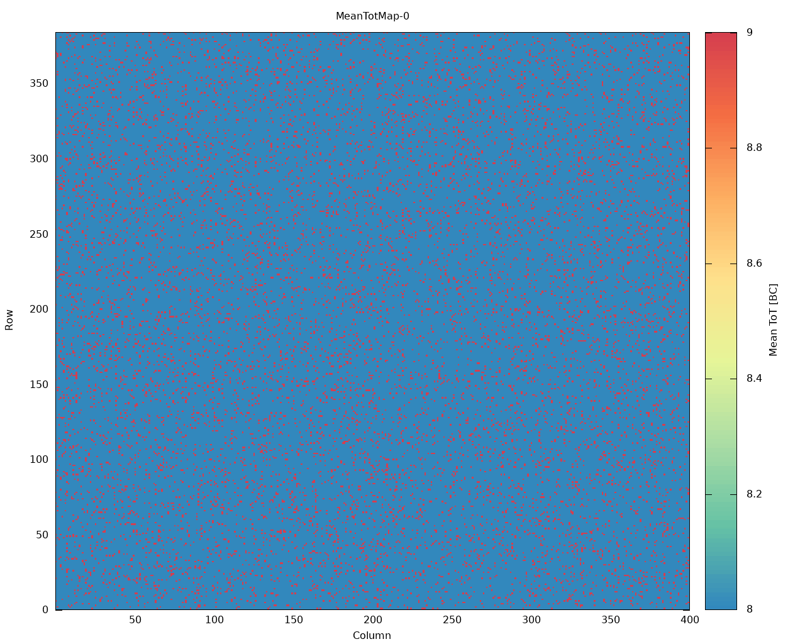
<figcaption>Digital (left) and analog (right) scan ToT maps in the ITkPixV2 emulator.</figcaption>
</figure>

As illustrated in the analog scan result above, the emulator introduces a random variation of the analog FE response in each pixel. The (Gaussian) generation of this variation is seeded with a unique ID of the emulated chip, and is therefore constant and reproducible in time.

This randomness, mimicking a non-ideal chip, is further pronounced in threshold scan:
```
./bin/scanConsole -r configs/controller/emuCfg_itkpixv2.json -c configs/connectivity/example_itkpixv2_setup.json -s configs/scans/itkpixv2/std_thresholdscan.json -p
```
For an untuned chip, the threshold distribution is wide due to the per-pixel threshold variations and noise (emulated as Gauss(0, 50e)). The figures below show the untuned threshold distribution and map.

<figure class="image">
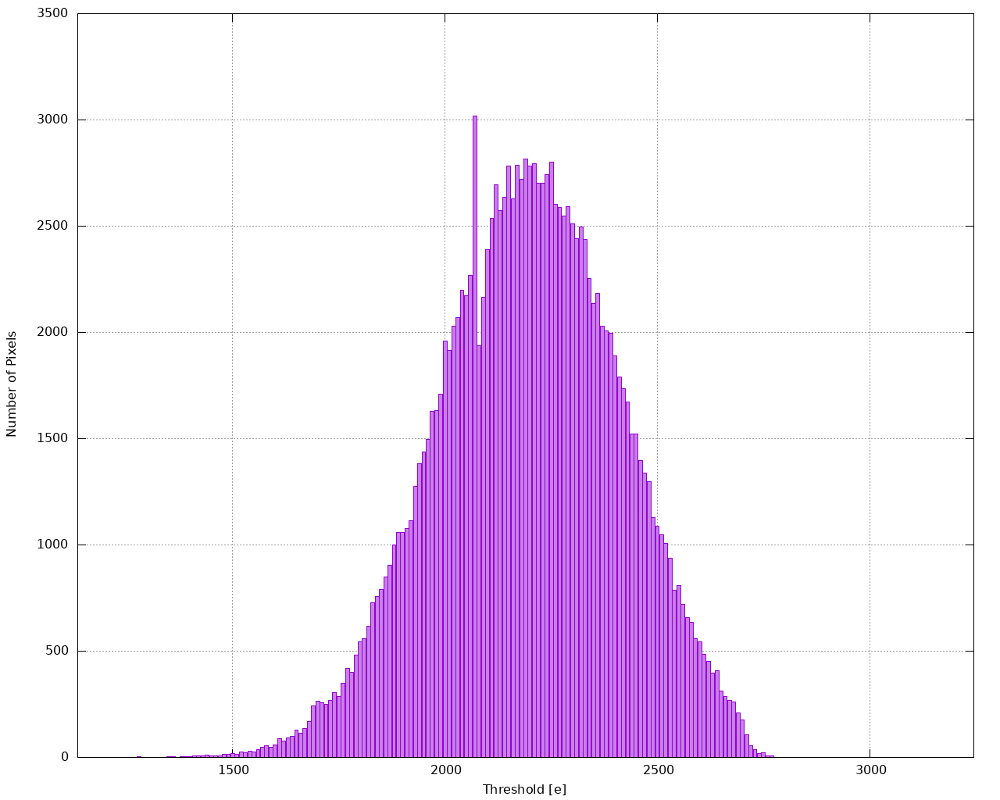
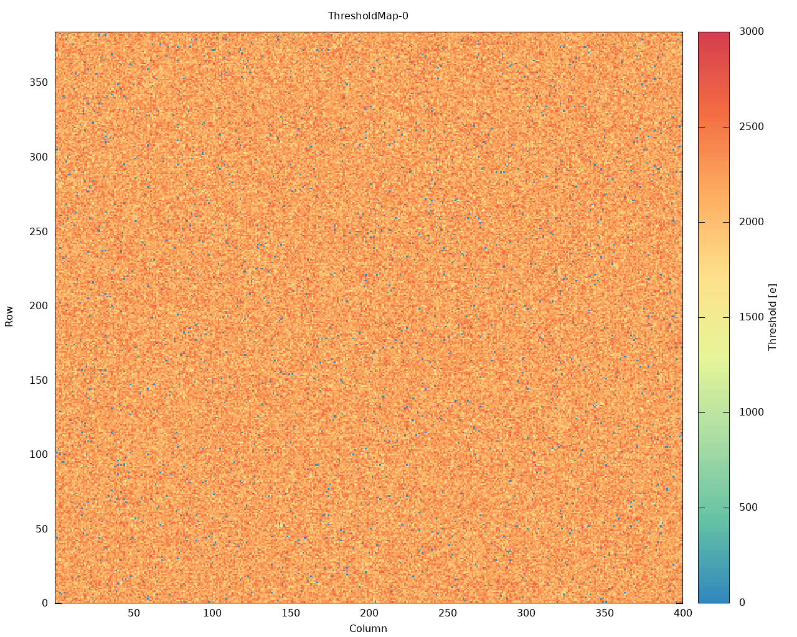
<figcaption>Untuned threshold distribution (left) and map (right), obtained with the ITkPixV2 emulator.</figcaption>
</figure>

One can tune the global threshold, resulting in an overall shift of the threshold distribution to average at the desired value, as well as pixel threshold tuning, which compensates for the non-idealness in each pixel. Figures below show the results of such tuning, which can be emulated with:
```
./bin/scanConsole -r configs/controller/emuCfg_itkpixv2.json -c configs/connectivity/example_itkpixv2_setup.json -s configs/scans/itkpixv2/std_tune_globalthreshold.json -p -t 2000
```
and
```
./bin/scanConsole -r configs/controller/emuCfg_itkpixv2.json -c configs/connectivity/example_itkpixv2_setup.json -s configs/scans/itkpixv2/std_tune_pixelthreshold.json -p -t 2000
```
<figure class="image">
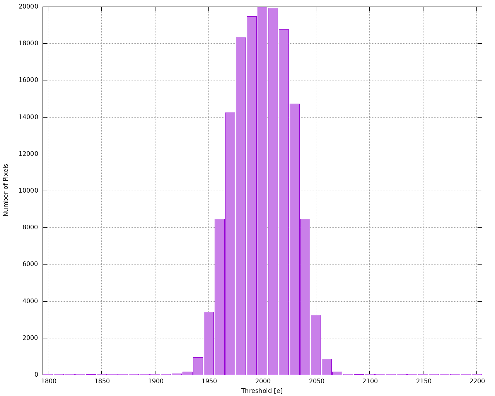
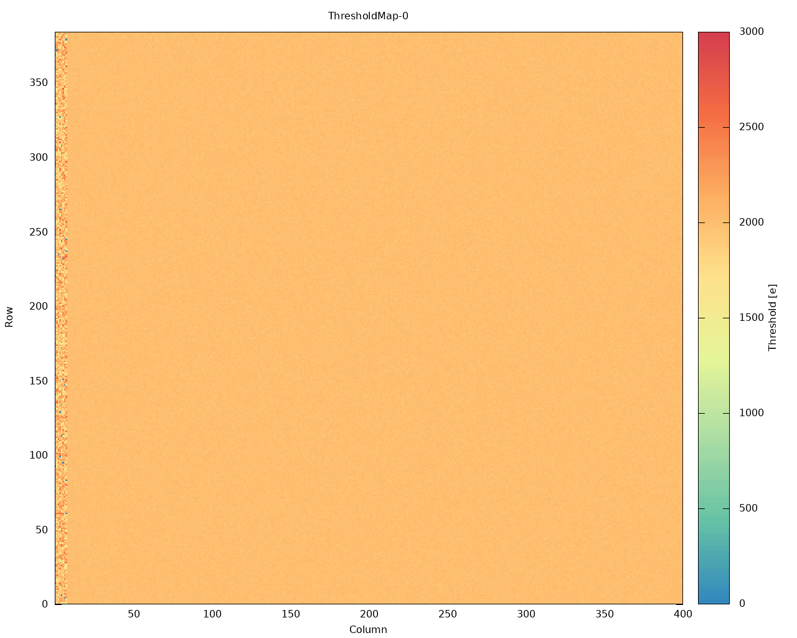
<figcaption>Tuned (except for the first core column) threshold distribution (left) and map (right), obtained with the ITkPixV2 emulator.</figcaption>
</figure>

## Inner structure
The emulator interacts with the outside through the `Itkpixv2Emu` class. `Itkpixv2Emu` instantiates two functional modules - `Itkpixv2EmuCommandInterpreter` and `Itkpixv2EmuCommandExe`. At the highest level, `Itkpixv2Emu` runs a loop that listens to the Tx and performs command interpretation and execution upon reception of data. This loop runs until stopped from the outside. The loop is sketched in the figure below.

<figure class="image">

<figcaption>Top-level emulator loop.</figcaption>
</figure>

### Command interpretation
All command interpretation is handled by the `Itkpixv2EmuCommandInterpreter` class. It is attached to the input Tx and for conveniece pre-buffers the incoming stream in 8-bit blocks. Depending on the header of each command, appropriate number of 8-bit blocks is processed at a time. Whenever needed, the block is 8-to-5 decoded through a LUT. Finally, a `Cmd` struct is formed:

```
struct Cmd {
    uint8_t header   = 0;
    uint8_t id       = 0;
    uint32_t address = 0;
    uint32_t data    = 0;
}
```

These interpreted commands are then passed through a FIFO to the `Itkpixv2EmuCommandExe`, which takes the appropriate action. A diagram of `Itkpixv2EmuCommandInterpreter` functionality is shown in the figure below.

### Carrying out commands
`Cmd` structs form the input to the `Itkpixv2EmuCommandExe`, which decides what action to take based on the `Cmd` header. `Itkpixv2EmuCommandExe` holds instances of several helper classes, such as `Itkpixv2Encoder` for producing the output streams, `Itkpixv2Cfg` to represent the chip registers and `ItkpixLayout` to represent ToT in the chip matrix. In the current state, commands are carried out serially, but the development was done with consideration of potential future multi-threading.

The following actions are taken for each command -

- `WrReg`  - write provided value to the addressed register. All flavours are supported (global, pixel, broadcast, multiple write, ...).
- `RdReg`  - Output the value of the desired register in a service block. Only one register is written out per service block, and only on request (no autoread).
- `Cal`    - Generate analog or digital signals in the pixels.
- `Trig`   - Encode the generated hits and send them out as the encoded stream with the appropriate trigger tag.
- `PLLock` - no action
- `Clear`  - no action


## Calibrations
Several calibrations based on real-chip measurements are used to translate between DAC, charge and ToT.

### Injection charge (DAC to e)
The injection charge is set in DACs in the chip registers, and is translated into electrons through a linear relation provided in `Itkpixv2Cfg::toCharge` function.

### Global threshold (DAC to e)

### Pixel threshold (TDAC to e)

### Charge to ToT (e to bits)


# RD53A emulator

## Usage

Assuming the user has installed the software following instructions in install.md, now go to "build" folder.

To run digital scan, do
```
bin/scanConsole -r configs/controller/emuCfg_rd53a.json -c configs/connectivity/example_rd53a_setup.json -s configs/scans/rd53a/std_digitalscan.json -p
```
To run analog scan, do
```
bin/scanConsole -r configs/controller/emuCfg_rd53a.json -c configs/connectivity/example_rd53a_setup.json -s configs/scans/rd53a/std_analogscan.json -p
```
The results obtained from these two scans look like the following
<figure class="image">
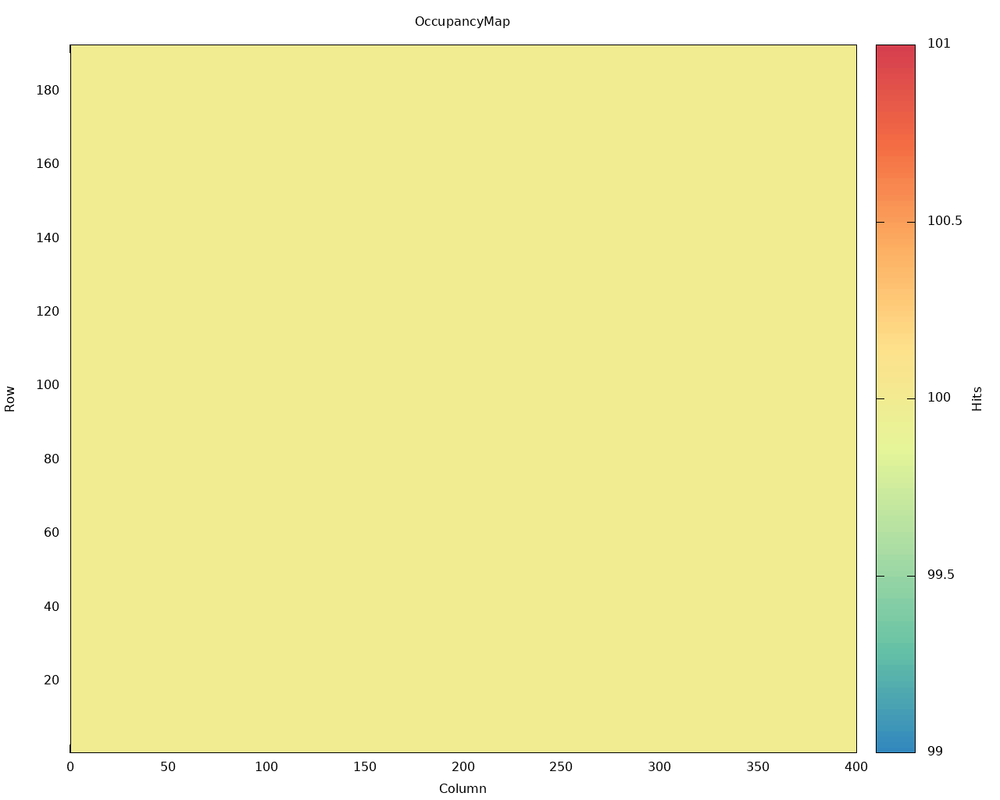

<figcaption>Digital (left) and analog (right) scan results in the RD53A emulator.</figcaption>
</figure>

Now move on to tune the "chip". The emulator is the idealization of the real hardware and does not contain the features in the physical chip. The tuning procedure is therefore simplier compared with the one detailed in rd53a.md. We could first tune the global thresholds to 1000e for all the three front-ends with the following commands.
```
bin/scanConsole -r configs/controller/emuCfg_rd53a.json -c configs/connectivity/example_rd53a_setup.json -s configs/scans/rd53a/syn_tune_globalthreshold.json -p -t 1000
bin/scanConsole -r configs/controller/emuCfg_rd53a.json -c configs/connectivity/example_rd53a_setup.json -s configs/scans/rd53a/lin_tune_globalthreshold.json -p -t 1000
bin/scanConsole -r configs/controller/emuCfg_rd53a.json -c configs/connectivity/example_rd53a_setup.json -s configs/scans/rd53a/diff_tune_globalthreshold.json -p -t 1000
```
After the tuning one should see the occupancy distribution centered around 50% like the following:
<figure class="image">
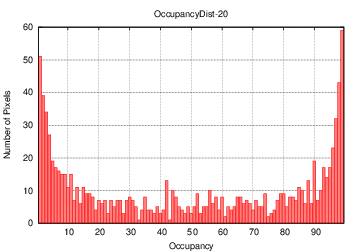
<figcaption>Result of global threshold tuning for linear front-end in the RD53A emulator.</figcaption>
</figure>

Now we can tune the pixel threshold. Run the following commands for linear and differential front-ends (N.B. for sync front-end this step is not needed):
```
bin/scanConsole -r configs/controller/emuCfg_rd53a.json -c configs/connectivity/example_rd53a_setup.json -s configs/scans/rd53a/lin_tune_pixelthreshold.json -p -t 1000
bin/scanConsole -r configs/controller/emuCfg_rd53a.json -c configs/connectivity/example_rd53a_setup.json -s configs/scans/rd53a/diff_tune_pixelthreshold.json -p -t 1000
```
This time we should see the occupancy distribution further concentrated around 50% like the following:
<figure class="image">
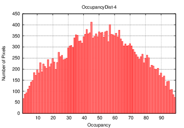
<figcaption>Result of pixel threshold tuning for linear front-end in the RD53A emulator.</figcaption>
</figure>

Finally let us run a threshold scan to check the tuning results:
```
bin/scanConsole -r configs/controller/emuCfg_rd53a.json -c configs/connectivity/example_rd53a_setup.json -s configs/scans/rd53a/std_thresholdscan.json -p
```
The threshold and noise distributions will look like following if everything is working fine:
<figure class="image">
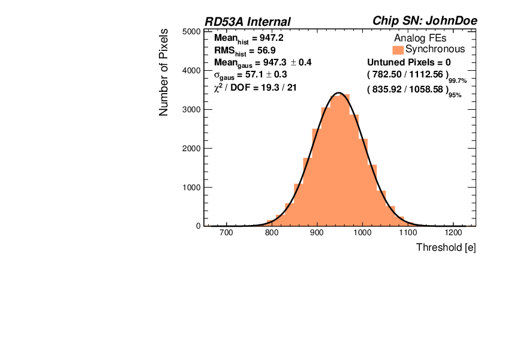
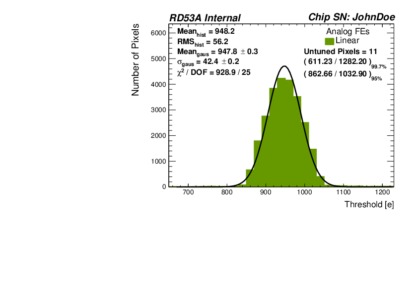
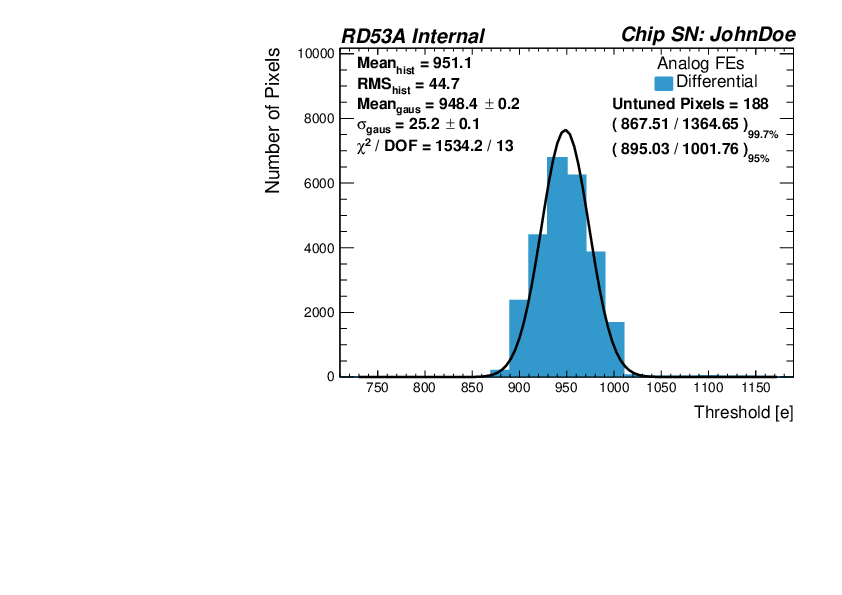
<figcaption>Threshold distributions for sync, linear, and differential front-ends.</figcaption>
</figure>
<figure class="image">
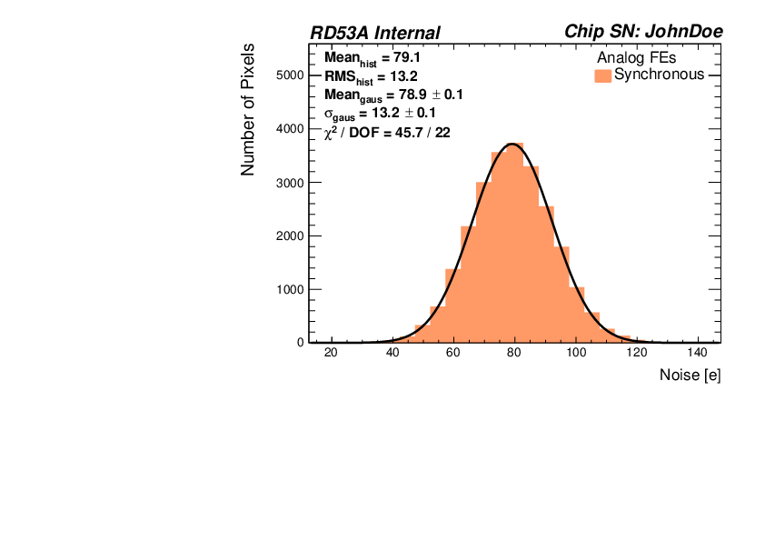
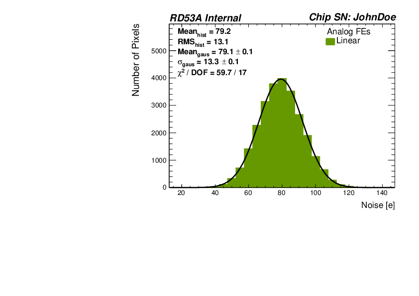
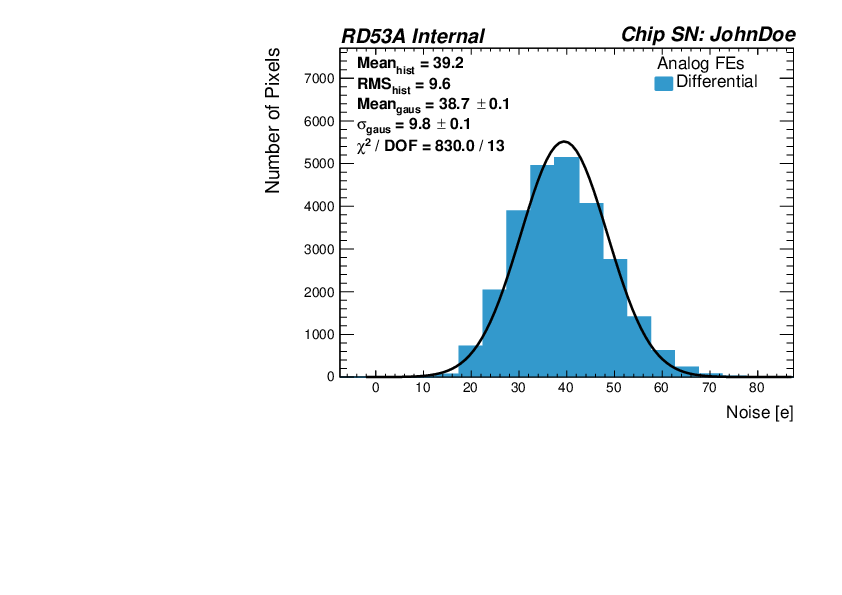
<figcaption>Noise distributions for sync, linear, and differential front-ends.</figcaption>
</figure>

## Input parameters
RD53A emulator has been implemented based on following measurements performed on real chips. The parameterizations implemented in the software emulator are summarized in the table below, and more details are provided in the following sections.

| Description | Parameterization |
| --- | --- |
| Vth -> threshold [e] | <ul><li>Sync: -175.807 + 9.13438 ⨉ SyncVth$$</li><li>Lin: -12827.1 + 39.298 ⨉ LinVth</li><li>Diff: 335.111 + 4.73165 ⨉ (DiffVth1-DiffVth2)</li></ul> |
| Threshold dispersion [Vth] | Sync: 5, Lin: 3, Diff: 20 |
| TDAC correction to threshold [Vth] | <ul><li>Sync: N/A </li><li>Lin: 3 ⨉ (TDAC - 8)</li><li>Diff: 15 ⨉ TDAC</li></ul> |
| Noise [e] | Mean Sync/Lin: 80, Diff: 40. Sigma=10 for all FEs |
| ToT [bc] vs. extra charge above threshold [10ke] | <ul><li>Sync: 1.21539 + 7.61735 ⨉ charge</li><li>Lin: 1.51625 + 7.29853 ⨉ charge</li><li>Diff: 4.56053 + 4.04173 ⨉ charge</li></ul> |

### Vth vs. threshold
The measurement is performed by first tuning the chip to a series of target thresholds following the procedure detailed in rd53a.md, and then plot the mean of the threshold distribution from a Gaussian fit as function of Vth values (the sigma of the Gaussian is included as error bar) for each front-end. The results are summarized in the following plots for three front-ends. Each case the data can be fitted well with a straight line.
These linear functions are implemented in the emulator to map the target threshold in electron charges into Vth.

<figure class="image">
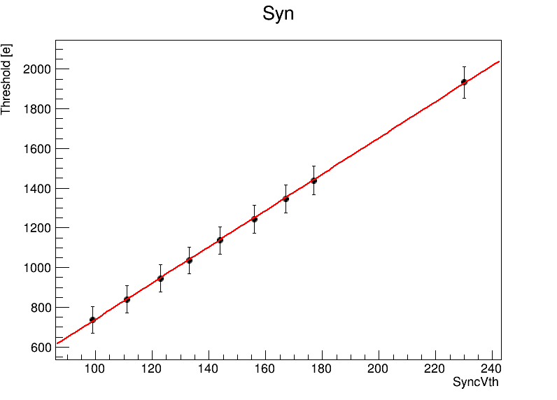
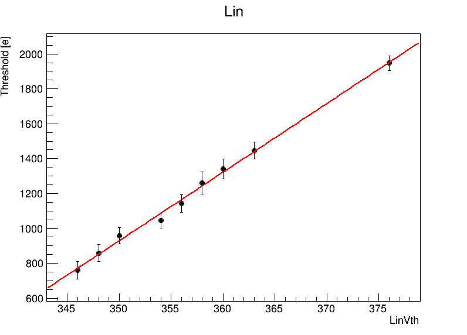
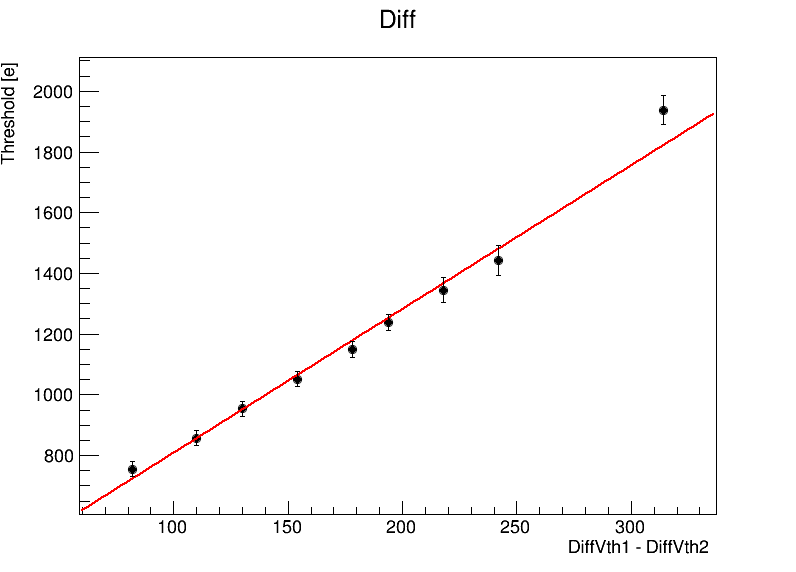
<figcaption>Threshold vs. Vth for sync, linear, and differential front-ends</figcaption>
</figure>

### Untuned pixel threshold dispersion
The untuned pixel thresholds on the chip have a dispersion. The dispersion is quantified using the real chip at different Vth values, with other global registers as well as pixel registers at default values. The obtained threshold distribution is first translated from electron charges to Vth using the linear function derived in previous section. Then it is divided by the corresponding Vth value of the front-end.
The distribution obtained can then be fitted with a Gaussian pdf. Both the mean and the sigma of the Gaussian are roughly constants as function of Vth as shown by plots below. In particular, the mean value divided by Vth is compatible with unity. The residual trends are not important to emulate.

<figure class="image">
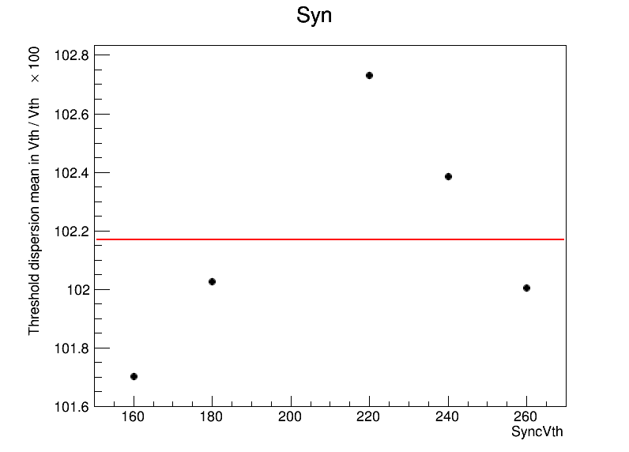
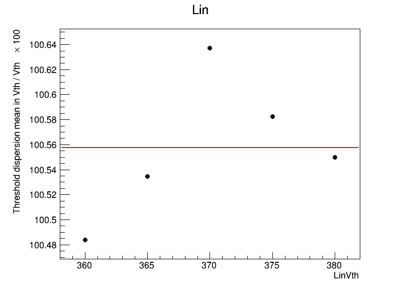
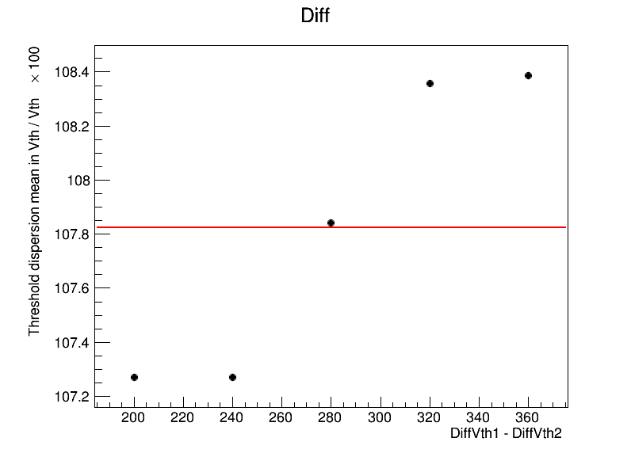
<figcaption>Mean of threshold distribution divided by Vth vs. Vth for sync, linear, and differential front-ends</figcaption>
</figure>

<figure class="image">
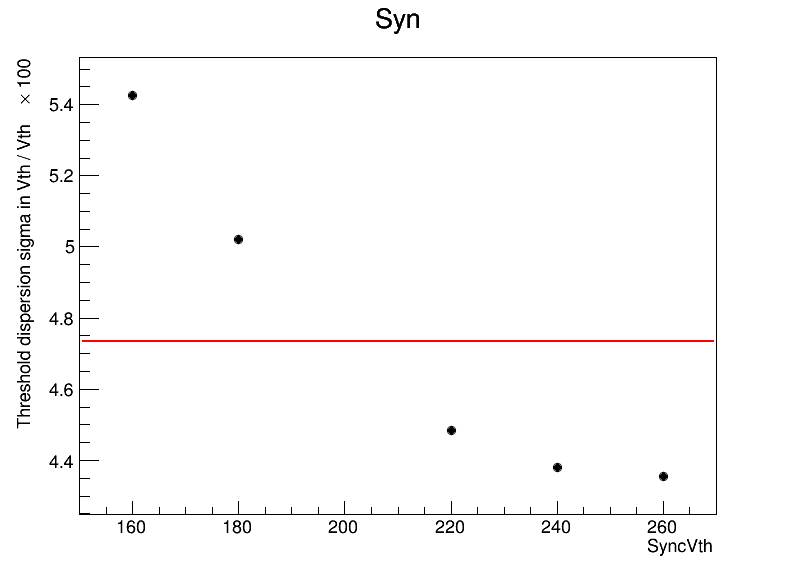
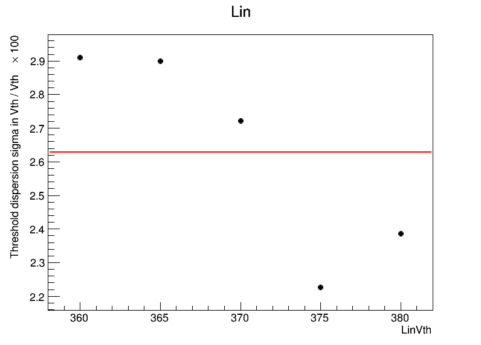
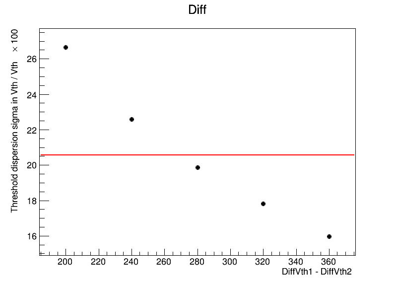
<figcaption>Sigma of threshold distribution divided by Vth vs. Vth for sync, linear, and differential front-ends</figcaption>
</figure>

### Pixel TDAC vs. threshold
Instead of characterizing TDAC response using the real chip, here a simplified approach is taken: a simple linear transformation of TDAC is added to the smeared threshold value. The coefficients of the linear function is tuned to roughly reproduce the observed resolution of threshold distribution after tuning.

### Pixel noise
The pixel noise is evaluated using the same threshold scans used to study threshold dispersion as discussed above. The mean and sigma of the width of the noise distribution are roughly constants as function of Vth as shown in plots below.

<figure class="image">
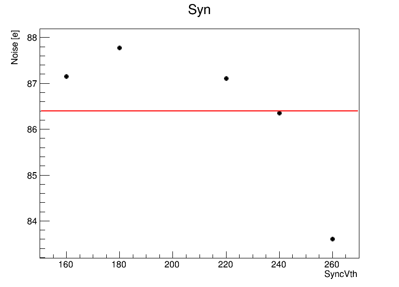
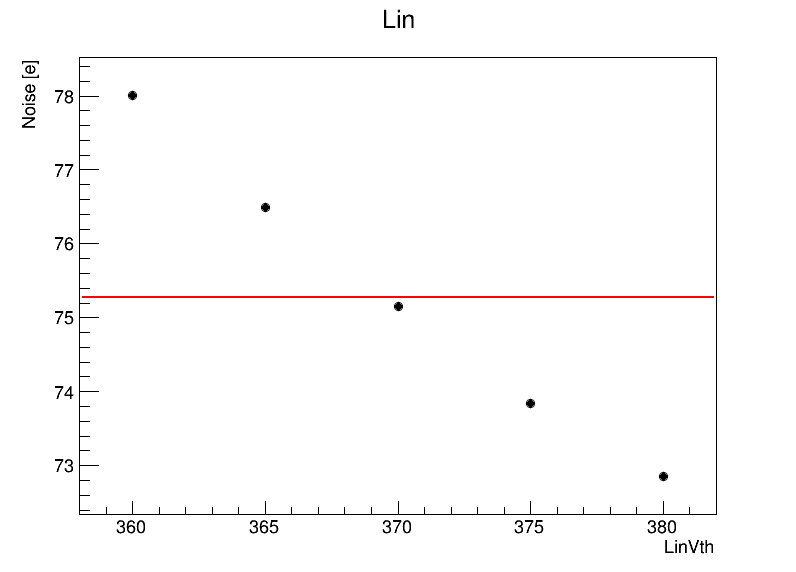
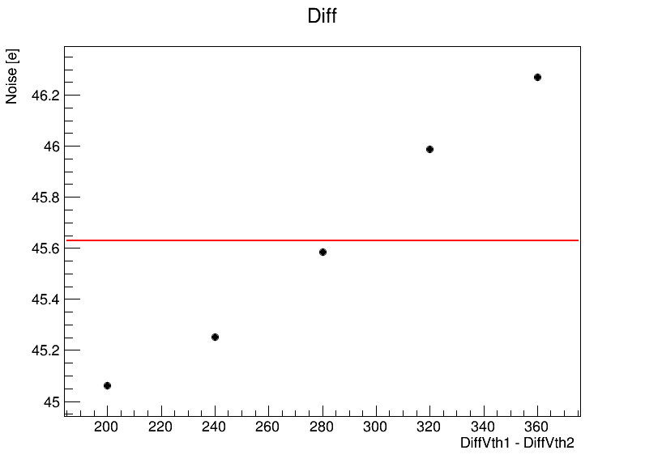
<figcaption>Mean of width of noise vs. Vth for sync, linear, and differential front-ends</figcaption>
</figure>

<figure class="image">
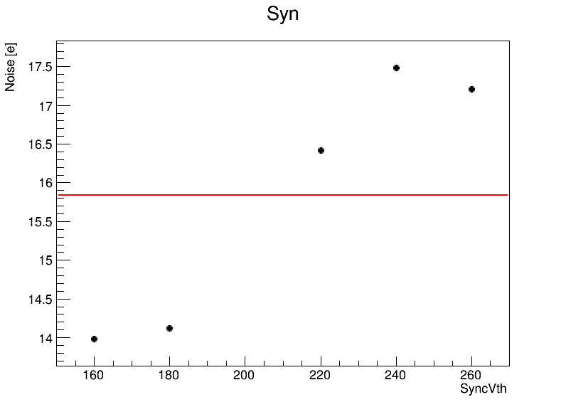
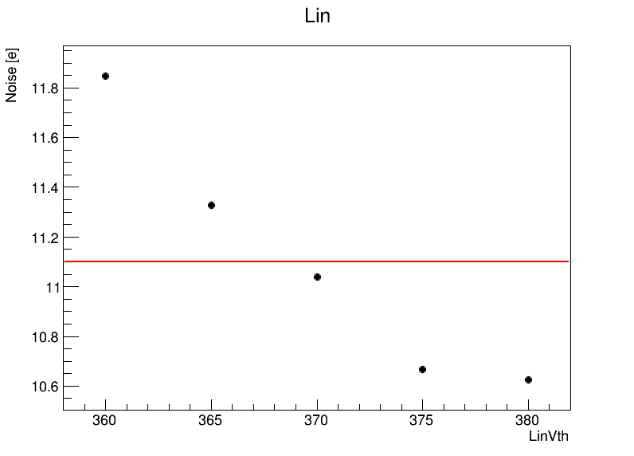
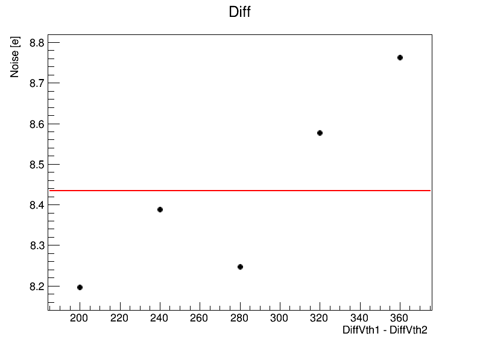
<figcaption>Sigma of width of noise vs. Vth for sync, linear, and differential front-ends</figcaption>
</figure>

### Time-over-threshold (ToT) vs. extra charge above threshold
The pixel ToT as function of extra charge above threshold is studied in the following steps. First, the chip is tuned to 1000e threshold, with ToT=8 bc at 10ke. Then the ToT is measured at different injection charges, ranging from 8ke to 12ke. Subtracting out the threshold (1ke), the results are summarized in the following plots. A linear function is good enough to model the data in each case.

<figure class="image">
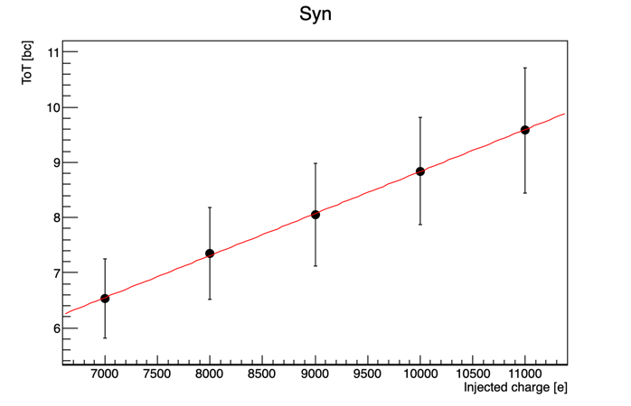
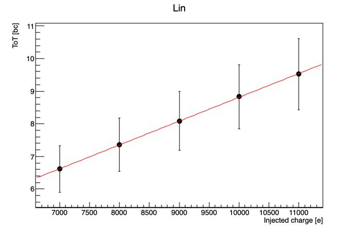
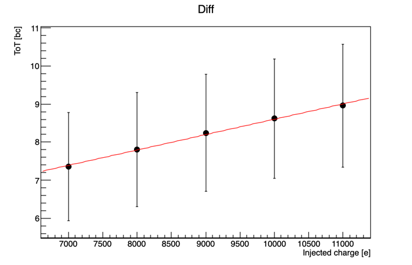
<figcaption>ToT vs. extra charge above threshold for sync, linear, and differential front-ends</figcaption>
</figure>

# RD53B emulator
Does not exist yet.

# Star emulator
The Star emulator emulates HCCStar and ABCStar front-end ASICs for
Strips.
More information about the Star emulator can be found in:
https://cernbox.cern.ch/index.php/s/shnadHRkX8g4ASY.

## Usage
To use the Star emulator, set `"type"` in the controller config to
`"emu_Star"`, and run `bin/scanConsole` or
`bin/star_test` using this controller config.

An example of the Star emulator controller config is provided in "configs/controller/emuCfg_star.json":
```json
{
    "ctrlCfg" : {
        "type" : "emu_Star",
        "cfg" : {
            "hprPeriod" : 40000,
            "feCfg" : "configs/emulator/emu_fe0_star.json",
            "chipCfg" : "config/connectivity/example_star_setup.json"
        }
    }
}
```
The "cfg" field of the Star emulator config takes three paramters:

- `"hprPeriod"` : HPR packet transmission period in the unit of number
of bunch crossings. (Default: 40000)
- `"feCfg"` : Path to the configuration file for the analog front-end model used in the
  emulator. It sets the parameters for modeling the front-end
  threshold and noise level. A dummy example is provided in
  "configs/emulator/emu_fe0_star.json"
- `"chipCfg"` : Path to the configuration file for chip setup. This
  config file is expected to follow the same format and syntax as the
  connectivity config file described in the
  [ScanConsole](scanconsole.md) documentation.

Note that the above example configures the Star emulator to use
channel 0 for tx and channel 0 for rx.
In order to get non-empty output when running `bin/star_test`, the rx
channel 0 needs to be enabled via the argument `-r` (by default, rx
channel 6 is enabled):
```bash
$ bin/star_test -r 0 configs/controller/emuCfg_star.json
```
Similarly, to use the example controller config with `bin/scanConsole`,
the connectivity config specified by `-c` needs to be compatible with the channels
in the controller config. For example:
```bash
$ bin/scanConsole -r configs/controller/emuCfg_star.json -c config/connectivity/example_star_setup.json -s <scan config>
```

The tx and rx channels for the Star emulator are configured via the
field `"chipCfg"` of the controller config. See more details below.

### Emulated Chip Configuration
The chip config file specified by the `"chipCfg"` field in the
controller config contains the chip type (in case of the Star emulator,
this should always be `"Star"`) and a list of chips with their
register configuration, tx and rx channels, etc.
Below is an example of the Star chip config ("config/connectivity/example_star_setup.json"):
```json
{
    "chipType" : "Star",
    "chips" : [
        {
            "config" : "configs/defaults/default_star.json",
            "tx" :  0,
            "rx" : 0,
            "enable" : 1,
            "locked" : 1
        }
    ]
}
```
In this example, there is one HCCStar chip. It uses tx channel 0
for commands and rx channel 0 for packet transmission.
Register contents of the HCCStar, as well as the ABCStar chips that connect
to it, are configured based on "configs/defaults/default_star.json" as
specified in the filed `"config"`.

#### Configuration for multiple HCCStars
To set up multiple HCCStar chips running in same or different
communication channels, simply add more entries in the `"chips"` array
and specify their tx and rx channels.
For example:
```json
{
    "chipType" : "Star",
    "chips" : [
        {
            "tx" : 1,
            "rx" : 2,
            ...
        },
        {
            "tx" : 1,
            "rx" : 2,
            ...
        },
        {
            "tx" : 1,
            "rx" : 3,
            ...
        },
        {
            "tx" : 4,
            "rx" : 5,
            ...
        }
    ]
}
```
In the above example, four HCCStars are configured.
The first three HCCStars share the same tx channel 1. The first and
second HCCStars also share the same rx channel 2, while the third one
uses a separate rx channel 3. The fourth HCCStar uses a different tx
channel 4 and a different rx channel 5.

#### Configuration for the multi-level trigger mode
To run the Star emulator in the multi-level trigger mode, a second tx
channel per FE needs to be set up for R3L1 commands.
This can be achieved by adding a `"tx2"` for each `"tx"` in the
chip configuration.
For example:
```json
{
    "chipType" : "Star",
    "chips" : [
        {
            "tx" : 0,
            "tx2" : 1,
            "rx" : 2,
            ...
        }
    ]
}
```
In the above case, the tx channel 0 is used for LCB, and the tx
channel 1 is used for R3L1 commands.
