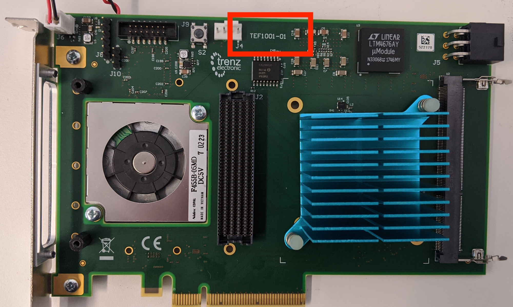
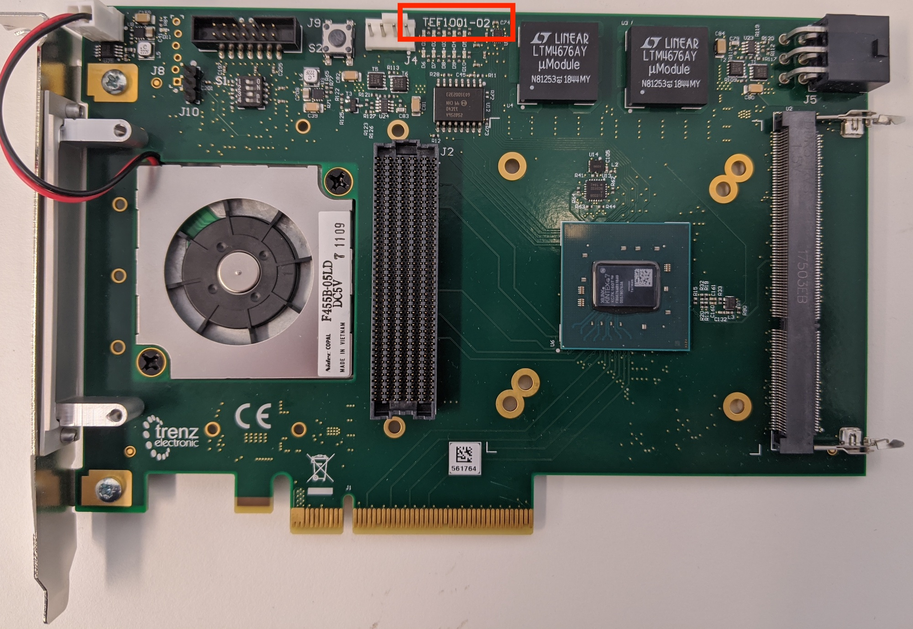
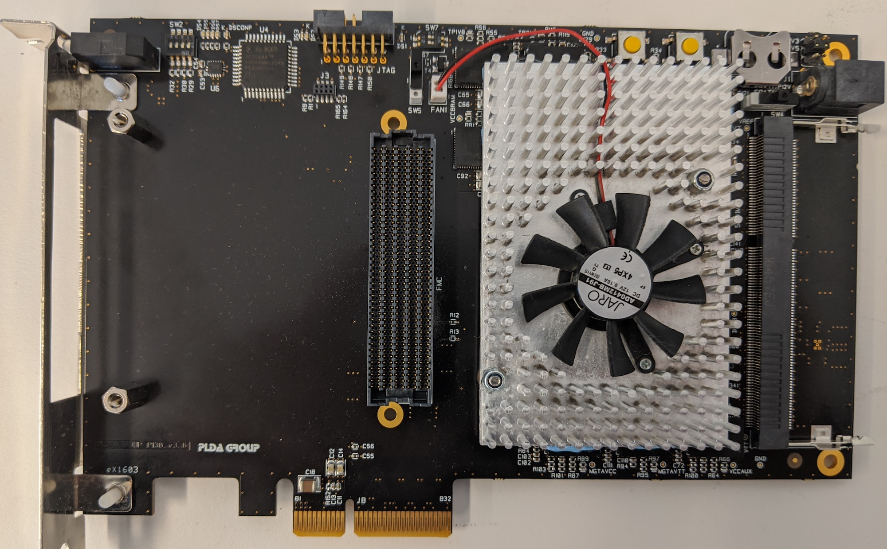
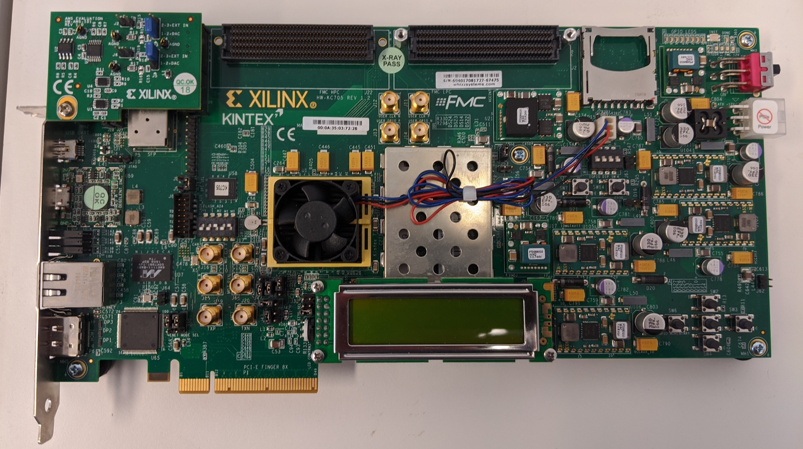
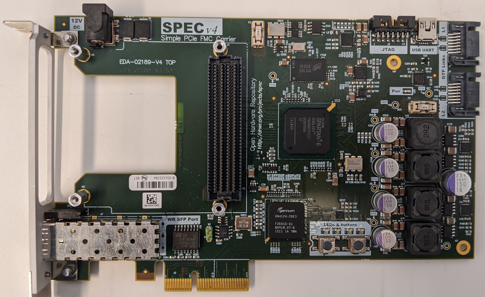
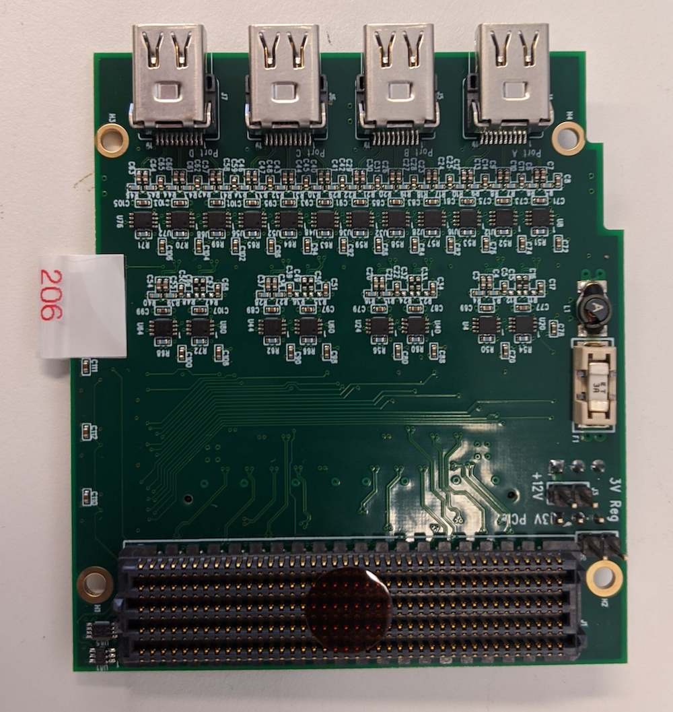
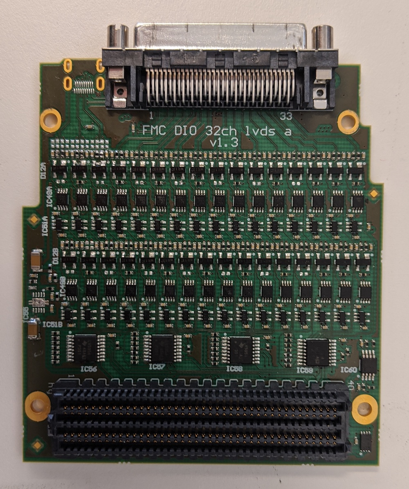

# PCIe Firmware and Hardware Guide

Note: For instructions for switching to the 1.28 Gbps firmware, please refer to the [Guide for Updating Firmware](updating_firmware.md)

For the YARR readout, most commonly Series 7 FPGAs are used - specifically the TEF1001 is the recommended FPGA, and XpressK7 and KC705 are also supported. If in doubt of what you have, see the following picture for identification:


## Prerequisites

* Xilinx Vivado Design Suite 2019.2 or latest Vivado Lab Solutions
* A JTAG programmer attached to the JTAG port to the PCIe card
  * I can recommend the [Digilent JTAG HS3](https://www.digikey.com/product-detail/en/digilent-inc/210-299/1286-1047-ND/5015666)
* Install the Xilinx cable driver, refer to [UG973](https://www.xilinx.com/support/documentation/sw_manuals/xilinx2016_4/ug973-vivado-release-notes-install-license.pdf)

## Setting up the Xilinx environment and flashing the firmware

Execute the following command to setup the Xilinx environment:
- For Vivado Design Suite
```bash
source /opt/Xilinx/Vivado/2019.2/settings64.sh
```
- For Vivado Lab Solutions
```bash
source /opt/Xilinx/Vivado_Lab/2019.2/settings64.sh
```
- This is the default install path, if the path is not correct you need to point it to your installation.

In order to flash the firmware, download the following script: [flash.sh](http://yarr.web.cern.ch/yarr/firmware/flash.sh)

```bash
$ wget --backups=1 http://yarr.web.cern.ch/yarr/firmware/flash.sh
$ <text>
$ ./flash.sh
```

The script can be used in two ways:

1. Run it by itself (without an argument) and it will ask some questions about what kind of configuration you desire. It will then download the latest firmware and proceed to flash the firmware to the FPGA and PROM.
2. Run it with an already downloaded bit-file as an argument and it will proceed to flash this firmware to the FPGA card. It will still ask what FPGA card you have as this specifies how to flash the firmware exactly.

Largely, case 1 should be applicable for getting the latest official firmware release. Specifically, the script will ask for:
- FPGA card: TEF1001 and XpressK7 are supported in the official releases
- Chip type: YARR is now almost exclusively used for reading out RD53 chips
- FMC card: FMC adapter card attached to the FPGA, most commonly the Ohio card is used
- Readout speed: 1280 Mbps, 640 Mbps and 160 Mbps are supported, and 1280 Mpbs is the baseline readout speed

Please check the [FPGA board types](#fpga-board-type) for more information!

Once you have flashed the firmware **reboot your PC**.

## Check the PCIe Status

- After the system has booted again check that firmware is loaded correctly.
  1. Check that the card appears in ``lspci``
```bash
$ lspci
<Some text>
02:00.0 Signal processing controller: Xilinx Corporation Device 7024
<Possibly more text>
```
  2. Check if the test programs runs successfully (Note that the ``Could not map BAR4, ...`` is normal for the Series 7 FPGAs)
```bash
$ cd Yarr/src
$ bin/specComTest
void SpecCom::init() -> Opening SPEC with id #0
void SpecCom::init() -> Mapping BARs
void SpecCom::init() -> Mapped BAR0 at 0x0x7f075e4b2000 with size 0x100000
void SpecCom::init() -> Mmap failed
void SpecCom::init() -> Could not map BAR4, this might be OK!
Starting DMA write/read test ...
... writing 8192 byte.g
... read 8192 byte.
Success! No errors.
```

- Your system is now **ready to use**

For further information for the questionnaire see the section below for more information!

## Further information for Questionaire

### FPGA Board Type

#### Trenz TEF1001

The Trenz TEF1001 comes in two revisions which can be identified by the label on the card.
Specific information about the cards can be found on their [wiki](https://wiki.trenz-electronic.de/display/PD/TEF1001+TRM).


Revision 1 specifics:

* Requires to be powered via the PCIe Molex connector.


Revision 2 specifics:

* Can be powered via PCIe Molex or directly from PCIe.
* DIP switches should be set to ``0,1,0,0`` (where the bits are ordered like this ``4,3,2,1``, same setting as in the picture) which is ``VCC_IO`` of 1.8V

#### PLDA XpressK7

There are two version of the XpressK7 card which differ in the specific FPGA type they use denoted by the 160 and 325. The majority of all people should have the 325 version. The only way to identify in case you do not know which version you have is to connect a JTAG programmer and scan the JTAG chain in Vivado, it will tell you the exact FPGA type. In case you try to flash the wrong firmware version, it will simply fail and tell you that the connected FPGA does not match the one the bit-file was created for.



As this card is not produced anymore by PLDA and you require more information, reach out to the ``yarr-user`` mailing list.

#### Xilinx KC705



#### CERN SPEC Spartan6

Only used for FE-I4 and FE65-P2 type chips.


For the Spartan 6 case it is required to have installed the software first. Then using the software the firmware is loaded into the board:

- Program the FPGA on the SPEC board
```bash
    $ cd Yarr/src
    $ bin/specS6ProgramFpga <path to Yarr-fw repo>/syn/spec/quad_fei4_revB/quad_fei4_revB.bit
    Opening file: ../hdl/syn/yarr_quad_fei4_revB.bit
    Size: 1.41732 MB
    =========================================
    File info:
    Design Name: yarr.ncd;HW_TIMEOUT=FALSE;UserID=0xFFFFFFFF
    Device:      6slx45tfgg484
    Timestamp:   2015/08/25 12:20:08
    Data size:   1486064
    =========================================
    Reading file.
    Opening Spec device.
    void SpecController::init() -> Opening SPEC with id #0
    void SpecController::init() -> Mapping BARs
    void SpecController::init() -> Mapped BAR0 at 0x0x7f5902cd1000 with size 0x100000
    void SpecController::init() -> Mapped BAR4 at 0x0x7f5903deb000 with size 0x1000
    void SpecController::configure() -> Configuring GN412X
    void SpecController::configure() -> MSI needs to be configured!
    Starting programming ...
    int SpecController::progFpga(const void*, size_t) -> Setting up programming of FPGA
    int SpecController::progFpga(const void*, size_t) -> Starting programming!
    int SpecController::progFpga(const void*, size_t) -> Programming done!!
    int SpecController::progFpga(const void*, size_t) -> FCL IRQ: 0x38
    int SpecController::progFpga(const void*, size_t) -> FCL IRQ indicates CONFIG_DONE
    int SpecController::progFpga(const void*, size_t) -> FCL Status: 0x2c
    int SpecController::progFpga(const void*, size_t) -> FCL STATUS indicates SPRI_DONE
    ... done!
```
- Look for the flags ``CONFIG_DONE`` and ``SPRI_DONE`` to signal successful programming
- Four LEDs on the SPEC board (close to the PCIe connector) should flash up like KITT from Knight Rider
- Which exact bit-file needs to be programmed depends on the use-case
- You can test if the firmware programming was successful by:
```bash
$ cd Yarr/src
$ bin/test
void SpecController::init() -> Opening SPEC with id #0
void SpecController::init() -> Mapping BARs
void SpecController::init() -> Mapped BAR0 at 0x0x7f885e98c000 with size 0x100000
void SpecController::init() -> Mapped BAR4 at 0x0x7f885eab7000 with size 0x1000
void SpecController::configure() -> Configuring GN412X
Starting DMA write/read test ...
... writing 8192 byte.
... read 8192 byte.
Success! No errors.
```
- The firmware has to be loaded after *every* reboot or power cycle of the system!


### FMC card

#### Ohio card

Used for RD53 and STAR chip readout.


In order to power correctly the adapter card, a jumper needs to be added to **3V PCI** pin, as shown on picture below.


When the board is powered correctly, a red LED should light up. More information about the adapter card can be found [Multi Chip Adapter Card](https://twiki.cern.ch/twiki/bin/viewauth/RD53/RD53ATesting#Multi_Chip_FMC).

On a SCC [Single Chip Card](https://twiki.cern.ch/twiki/bin/viewauth/RD53/RD53ATesting#RD53A_Single_Chip_Card_SCC) the CMD line is AC coupled. On the older Ohio card (before 2019 and serial number < 200) there is additional AC coupling as shown on the picture. This is corrected for the newer Ohio cards from 2019 on with serial number starting from 200.


To avoid double AC coupling on the CMD line, one should replace the capacitors with jumpers and remove the termination, as shown on the picture.


In order to read the HitOrs from Port B and Port D, one has to modify the AC coupling of the data lines on the Ohio card:


The capacitors should be replaced with jummpers as shown on the picture:


#### Creotech 32ch VHDCI

Used for FE-I4 readout.


### FE Chip Type

Supported chips are:

- FE-I4
- FE65-P2
- RD53A/B
- ABC/HCCStar

### RX Speed

Not all speeds might be supported for all chips this is somewhat chip dependent:

- FE-I4: 160Mbps
- FE65-P2: 160Mbps
- RD53A/B: 160Mbps/640Mbps/1280Mbps
- ABC/HCCStar: 320Mbps

Make sure to change the chip configuration to transmit at the right speed. Details can be found on the respective chip page.

### Channel Configuration

Not all configuration are available for all chip types:

- FE-I4: tbd
- FE65-P2: 1x1
- RD53A/B: 4x4, 16x1
- ABC/HCCStar: 4x1

If the channel configuration is ZxY then Y is number of lanes per channel (only applies to RD53A/B) and Z is the total number of channels, where the channel typically refers to one chip (or hybrid in case of strips). If one wants to read out 4 RD53A/B single chips: select 4x4. If one wants to read out one RD53A/B quad module with one DP per chip: use 4x4. But if one wants to read out an RD53A/B chip with only 1 DP port: select 16x1 (i.e. 4 channels with 1 lane per DP).
