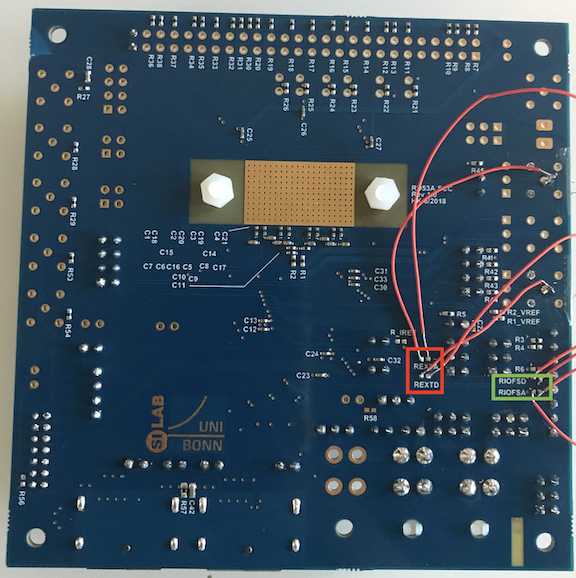
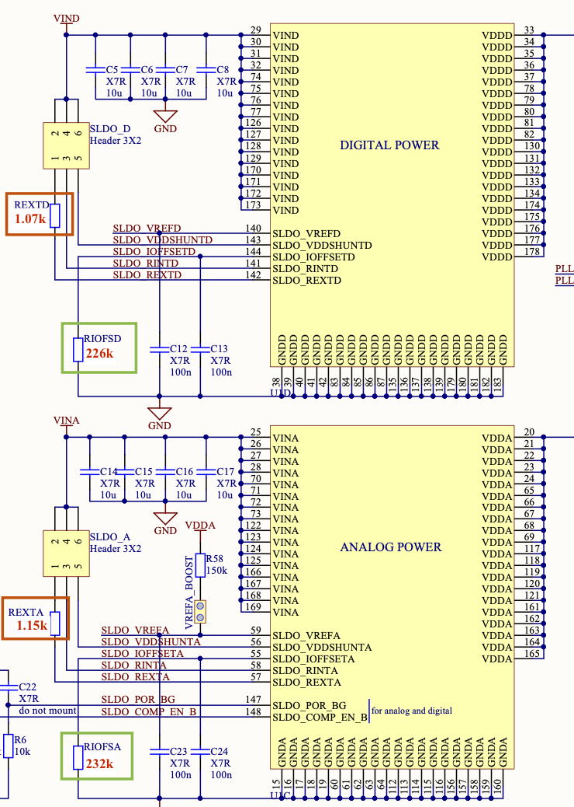
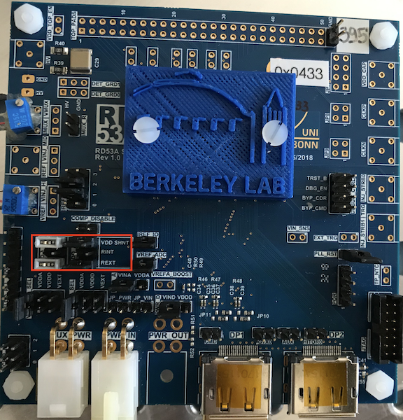
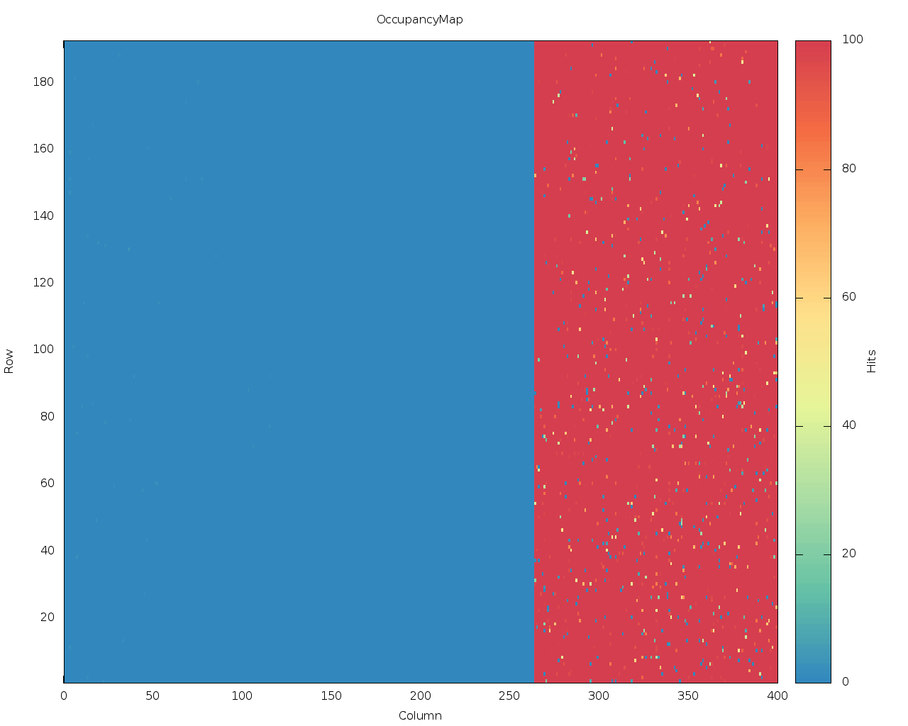
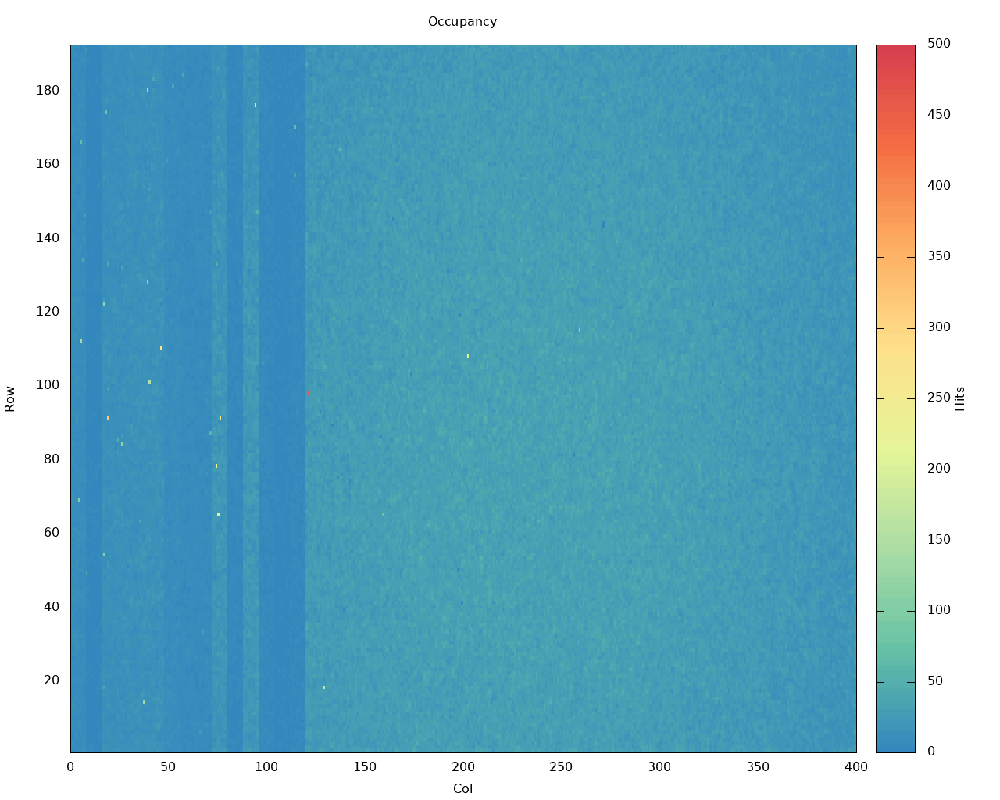

# RD53A testing with the Single Chip Card
More details about the SCC can be found here: [Single Chip Card](https://twiki.cern.ch/twiki/bin/viewauth/RD53/RD53ATesting#RD53A_Single_Chip_Card_SCC)

## Jumper configuration and power on


Default settings for operation in **LDO mode**

- PWR_A and PWR_D: VINA and VIND (LDO operation)
- VDD_PLL_SEL: VDDA (PLL driver from VDDA supply)
- VDD_CML_SEL: VDDA (CML driver from VDDA supply)
- VREF_ADC (internal ADC voltage reference)
- IREF_IO (internal current refetrence)
- IREF_TRIM: Jumper to 3 to set the internal reference current at 4 μA
- Jumpers JP10 and JP11 should be closed in order to use LANE 2 and 3
- Add a PLL_RST jumper
- Add a 5 kΩ resistor for R3 to pull up Vctrl to Vdd (back side of the SCC)

**Make sure that the jumper configuration marked in red is correct before powering the chip!!! Applying too high voltage may kill the chip.**

After all jumpers are placed on the SCC, connect the DisplayPort cable to DP1 and power cable to PWR_IN.

Set the power supply to <span style="color:red">**1.8**</span> V, the current should be around 0.5 A (combined for analog and digital) and power on the chip. For the LDO operation, e.g. the jumper configuration shown in previous figure, make sure <span style="color:red"> not to apply higher voltage than **1.8 V**</span>.


## Running RD53a in ShuLDO mode

To run the SCC in shunt mode, shunt resistors needed to be appropriately loaded, as well as adding additional jumpers. For more information, please refer to [this presentation](https://indico.cern.ch/event/858912/contributions/3616969/attachments/1932760/3201729/sldo_calibration_er.pdf)

### Loading shunt resistors



4 shunt resistors need to be soldered on the back of the SCC, pictured above, and in the schematic:

- RextA: analog external resistor, resistor that sets the slope for the analog shunt IV. The value of this resistor is `1.15k` ohm.
- RextD: digital external resistor, resistor that sets the slope for the digital shunt IV. The value of this resistor is `1.07k` ohm.
- RIoffsA: analog offset resistor, resistor that sets the offset for the analog IV curve. The value of this resistor is `232k` ohm.
- RIoffsD: digital offset resistor, resistor that sets the offset for the digital IV curve. The value of this resistor is `226k` ohm.

### Jumper configuration for shunt mode operation


In addition to soldering shunt resistors, jumpers are needed to select the ShuLDO operation mode.
- VDD Shnt A and VDD Shnt D: select shunt mode operation
- Rext A and Rext D: select slope resistors soldered on the SCC as opposed to the internal shunt resistors

### Shunt mode operation
LDO mode is set in <span style="color:red">constant voltage</span>, where the power supply voltage is set and the current consumed by the chip can be measured.

In shunt mode, the power supply is set in <span style="color:red">constant current</span> mode. The maximum voltage is set to <span style="color:red">**1.8 V**</span>, and the current is set to <span style="color:red">**1.1 A**</span>. The current to the chip will be 1.1 A and the voltage measured is 1.6 V (less than the maximum value of 1.8V).

All scans described above can be performed in shunt mode.


## Running with multiple RD53a chips

All subsequent scans assume single chip operation; however, when testing triplets or quads, there will be 3-4 FE ends. Operation will be the same as for a SCC except for the set-up.

Here are some things to be mindful of as you are planning on running with multiple RD53a:

- multiple PCIexpress cards: each PCIexpress card has its own `specNum`; therefore, the user needs to creat one specCfg-rd53a.json per PCIExpress card.
- setting up the configuration for whether each RD53a receives its own command or will share a command line. Both of these instances are described in [ScanConsole](scanconsole.md).
- setting up the correct chipId for each RD53a in a triplet or a quad. After running a scan or just running scanConsole without running a scan, a configuration for each chip will be created. The `ChipId` for each FE will be set to 0 (default). You must change this value to match the wire-bonded value in each configuration. 

### Running scans with multiple chips
The scans will be run on all chips that are enabled. If an error occurs, it will be associated with a chip number.
```bash
629258304 [1] Received data not valid: [17723,50400] = 0xcc53ff2f
```
In the above example, chip with tx/rx 1 did not receive valid data.

### Additional configuration changes for quad modules

To run quad modules, you need to set up the chips such that all 4 chips share one command line. This is further described in [ScanConsole](scanconsole.md). In order to distinguish different chips, communication is done via chip IDs which are set via wirebonds on a quad module. The corresponding values have to be set in the chip configurations as well:

- `ChipId`: the ChipId for each chip should be set according to wirebonding map and the silk screen on the module PCB (Chip1: `1`, Chip2: `2`, Chip3: `3`, Chip4: `4`)

Depending on how many lanes per chip you read out, the correct [firmware](fw_guide.md#channel-configuration) is needed too. On an RD53A quad module PCB only 3 out of 4 lanes per chip are connected.

If you have a 4-display port adaptor card, the correct controller configuration file shall be used to read out all connected lanes:
``specCfg-rd53a-4x3.json``

Additionally, changes for the quad module's chip configurations apply:

- `OutputActiveLanes`: 7 instead of 15 because only 3 data lanes are connected, not 4
(- `CmlEn`: 7 instead of 15)

If you have a 1-display port adaptor card, the correct controller configuration file is ``specCfg-rd53a-16x1.json`` and the changes in the chip configurations are:

- `OutputActiveLanes`: 1 instead of 15 because now only lane0 is connected on the readout adapter card
(- `CmlEn`: 1 instead of 15)


## Scan Console for RD53A

The general structure of the Scan Console commands is:

```bash
bin/scanConsole -r configs/controller/specCfg-rd53a.json -c configs/connectivity/example_rd53a_setup.json -s configs/scans/rd53a/<type of scan>.json -p
```
which specifies the controller (`-r`), the chip list and chip type (`-c`), and the scan (`-s`). The option `-p` selects plotting so plots are produced after the scans.
If you run a scan for the first time, it will create a default configuration for the chip along with running the scan.

To create the default chip configuration without running a scan:
```bash
bin/scanConsole -r configs/controller/specCfg-rd53a.json -c configs/connectivity/example_rd53a_setup.json
```

More general information about how to use the scanConsole, can be found on the main page: [ScanConsole](scanconsole.md). This page details each of the configuration settings. 

In case you run into problems or have abnormal results please consult the troubleshooting page here: [Troubleshooting](troubleshooting)

### Tuning routine

Examples of the result and how to run different scans is shown below. If you have mastered the basics, you probably just need this information.
Basics tuning routine:

- `std_digitalscan.json` (with `-m 1` to reset masks)
- `std_analogscan.json`
- `diff_tune_globalthreshold.json` (good starting threshold target is 1000e, resets prev. TDACs)
- `diff_tune_pixelthreshold.json` (1000e target again)
- `diff_tune_finepixelthreshold.json` (1000e target again)
- `lin_tune_globalthreshold.json` (good starting threshold target is 2000e, resets prev. TDACs)
- `lin_tune_pixelthreshold.json` (2000e again)
- `lin_retune_globalthreshold.json` (now retuning from 2000e to 1000e target)
- `lin_retune_pixelthreshold.json` (1000e again)
- `lin_tune_finepixelthreshold.json` (1000e again)
- `syn_tune_globalthreshold.json` (can be as low as 1000e, but keep noise occupancy in check)
- `std_thresholdscan.json` (verify thresholds, use root plot script for nice plots, see [here](rootscripts))
- `std_totscan.json` (with target charge equal to MIP, e.g. 12ke)
- `std_noisescan.json` (measure noise occupancy, will mask noisy pixels, might fail if too noisy)

If you also want to tune the ToT conversion we need to insert those tunings and also some threshold retunings. For a bsic routine including those see below:

- `std_digitalscan.json` (with `-m 1` to reset masks)
- `std_analogscan.json`
- `diff_tune_globalthreshold.json` (good starting threshold target is 1000e, resets prev. TDACs)
- `diff_tune_pixelthreshold.json` (1000e target again)
- `diff_tune_globalpreamp.json` (use mid of the range ToT values, e.g. 10000e at 8ToT)
- `diff_tune_pixelthreshold.json` (1000e target again)
- `diff_tune_finepixelthreshold.json` (1000e target again)
- `lin_tune_globalthreshold.json` (good starting threshold target is 2000e, resets prev. TDACs)
- `lin_tune_pixelthreshold.json` (2000e again)
- `lin_retune_globalthreshold.json` (now retuning from 2000e to 1000e target)
- `lin_retune_pixelthreshold.json` (1000e again)
- `lin_tune_globalpreamp.json` (use mid of the range ToT values, e.g. 10000e at 8ToT)
- `lin_retune_pixelthreshold.json` (1000e again)
- `lin_tune_finepixelthreshold.json` (1000e again)
- `syn_tune_globalthreshold.json` (can be as low as 1000e, but keep noise occupancy in check)
- `syn_tune_globalpreamp.json` (use mid of the range ToT values, e.g. 10000e at 8ToT)
- `syn_tune_globalthreshold.json` (can be as low as 1000e, but keep noise occupancy in check)
- `std_thresholdscan.json` (verify thresholds, use root plot script for nice plots, see [here](rootscripts))
- `std_totscan.json` (with target charge equal to MIP, e.g. 12ke)
- `std_noisescan.json` (measure noise occupancy, will mask noisy pixels, might fail if too noisy)

### Common misconceptions and issues

Some general tips when operating RD53A with YARR:

- There can be interference between the analog FEs, for instance when one FE is badly tuned and very noisy it might radiate noise into other FEs. Hence one should make sure that even when only using one FE type, that the other FEs are in a decent state (e.g. high threshold).
- Auto-zeroing is performed by the hardware and therefore the auto-zero frequency is set by the hardware controller.
- Auto-zeroing can cause transients on the power line which can cause other FEs to be noisy. So if someone chooses not to use the sync FE, one should also turn-off auto-zeroing in the controller config (by setting the auto-zero word to `0`).

### Scans

For generic RD53 scans see [this](../rd53/#scans) section.

#### Analog scan for only one analog FrontEnd

```bash
bin/scanConsole -r configs/controller/specCfg-rd53a.json -c configs/connectivity/example_rd53a_setup.json -s configs/scans/rd53a/diff_analogscan.json -p
```

- There are similar scan configs for the linear and sync FE

### Tuning

RD53A has 3 FEs: synchronous, differential, and linear. Each FE needs to be tuned independently. The full tuning procedure is described in the Tuning Routine section.

The tuning usually starts by tuning the global threshold DAC of the FrontEnd you want to tune:

- `DiffVth1` for the differential FE
- `SyncVth` for the synchronous FE
- `LinVth` for the linear FE


### Source Scan

There are 3 different possibilities for a source scan:
 
 1. noise scan (random trigger)
 2. external trigger scan with Hit-Or ("self-trigger")
 3. external trigger scan with a real trigger, e.g. scintilltor (external trigger)
 
#### Random Trigger

For a random trigger source scan one has to mask digital and analog bad pixels and noisy pixels by running digital, analog and noise scans: run `std_digitalscan` with the `-m 1` option to reset the pixel enable mask (see [commandline arguments](#command-line-arguments)), followed by `std_analogscan` and `std_noisescan` before a source scan with random trigger.

When taking data with a radioactive source, modify in `std_noisescan.json`: `"createMask": false` to prevent changing the enable mask, and adjust `"time": 600` in seconds to set the scan duration.

For RD53A module QC, use frontend-specific scans for the masking. There are automated scripts in `scripts` which can be used, e.g.
```
./scripts/rd53a-module_syn_masking.sh configs/controller/specCfg-rd53a-4x3.json configs/connectivity/example_rd53a.json
```
This combines the scans above for the synchronous frontend and prepares it for the source scan. Then run the frontend-specific source scan `syn_noisescan.json` with `"createMask": false` and adjusted scan duration.

Repeat the same step for `lindiff`.

##### Known Problem (to be verified)

The trigger loop in this scan does not sent an ECR signal during the scan. The sync FE does not delete 0-ToT hits in the buffer and/or the EOC logic gets stuck (with too many hits?) if no ECR is sent. Therefore a stripy pattern can occur in the sync FE.



#### Hit-Or ("self-trigger")

For the "self-triggering" source scan using Hit-Or as a trigger, a second DP-miniDP cable is needed to connect to the second DP port in the SCC and port B on the Ohio card, which should have the [modifications](ohio-rd53a-multi-module-adapter) on port B. The corresponding firmware has to be used and can be obtained from firmware [v0.9.2](https://github.com/Yarr/Yarr-fw/tree/v0.9.2) as the bit files which do not end with ``_4chip.bit``. For the controller configuration, instead of the `specCfg-rd53a.json` `specCfgExtTrigger.json` is to be used. The Hit-Or lines have to be enabled in the chip config:
```
"HitOr0MaskDiff0": 65535,
"HitOr0MaskDiff1": 1,
"HitOr0MaskLin0": 65535,
"HitOr0MaskLin1": 1,
"HitOr0MaskSync": 65535,
"HitOr1MaskDiff0": 65535,
"HitOr1MaskDiff1": 1,
"HitOr1MaskLin0": 65535,
"HitOr1MaskLin1": 1,
"HitOr1MaskSync": 65535,
"HitOr2MaskDiff0": 65535,
"HitOr2MaskDiff1": 1,
"HitOr2MaskLin0": 65535,
"HitOr2MaskLin1": 1,
"HitOr2MaskSync": 65535,
"HitOr3MaskDiff0": 65535,
"HitOr3MaskDiff1": 1,
"HitOr3MaskLin0": 65535,
"HitOr3MaskLin1": 1,
"HitOr3MaskSync": 65535,
```

#### External trigger

One easy way to use the external trigger scan is to connect a scintillator to a TLU and use the DUT interface with the RJ45 outputs through a RJ45-DP adapter (for EUDET TLU) or with the HDMI outputs using a HDMI-miniDP cable (AIDA TLU).

##### Hardware
 - a scintillator with a PMT
 - an EUDET TLU
   - a RJ45 cable
   - a RJ45-DP converter
   - a second DP-miniDP cable
 - OR an AIDA TLU
   - HDMI-miniDP cable
 
##### Installation

For running the TLU in standalone mode you need to install ``libusb`` and ``libusb-devel`` version 0.1 (!) on your (CentOS) computer.
Get eudaq from [here](https://github.com/eudaq/eudaq/tree/master/user/tlu) and compile it with ``USER_TLU_BUILD=ON`` option.
The TLU only produces trigger when the software is running with e.g. ``./EudetTluControl -a 1 -hm 0 -d 1 -i RJ45 -q``. Please refer to the [TLU manual](https://twiki.cern.ch/twiki/bin/view/MimosaTelescope/TLU) for the options.

The second DP-miniDP cable connects the RJ45-DP connector to port D which should accept TLU input with the non-multichip FW on the FPGA.

## Disabling FEs

The default values for the FEs in the chip configuration are

- `EnCoreColDiff1`: 65535; enables each bit in the 16 core columns 
- `EnCoreColDiff2`: 1; enables the 17th core column
- `EnCoreColLin1`: 65535; enables each bit in the 16 core columns
- `EnCoreColLin2`: 1; enables the 17th core column
- `EnCoreColSync`: 65535; enables each bit in the 16 core columns

To disable a FE, you need to set the appropriate `EnCoreCol` to 0.
