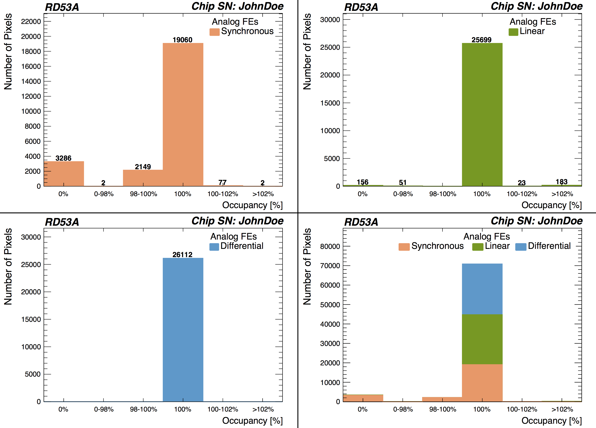
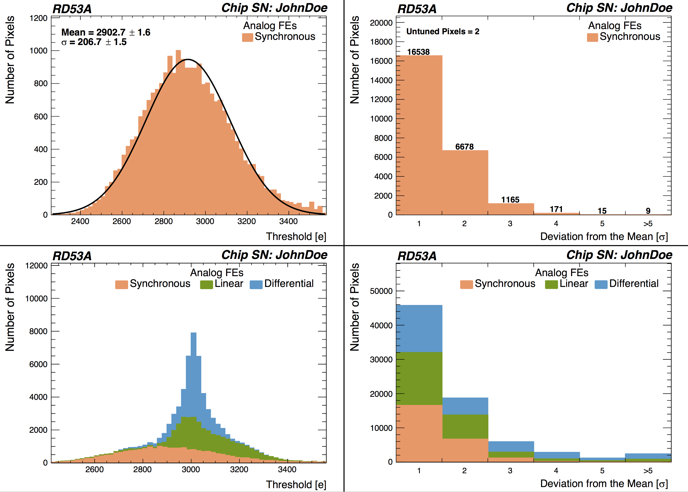
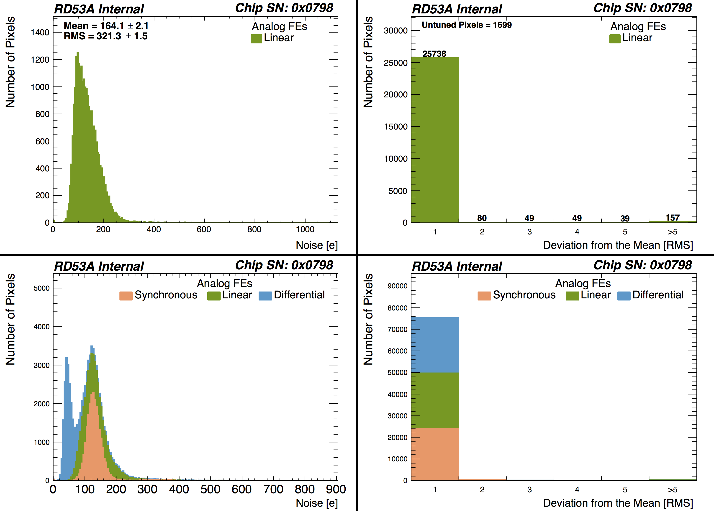
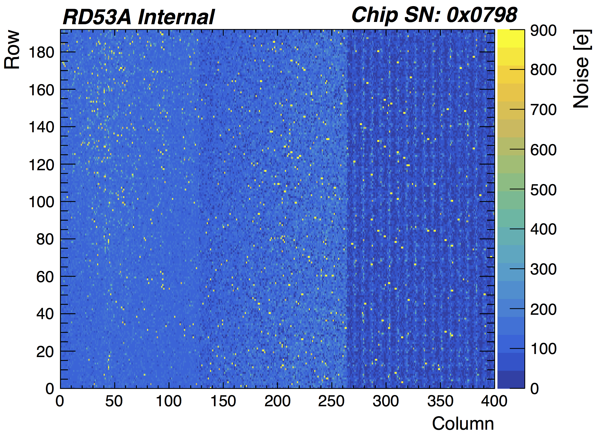
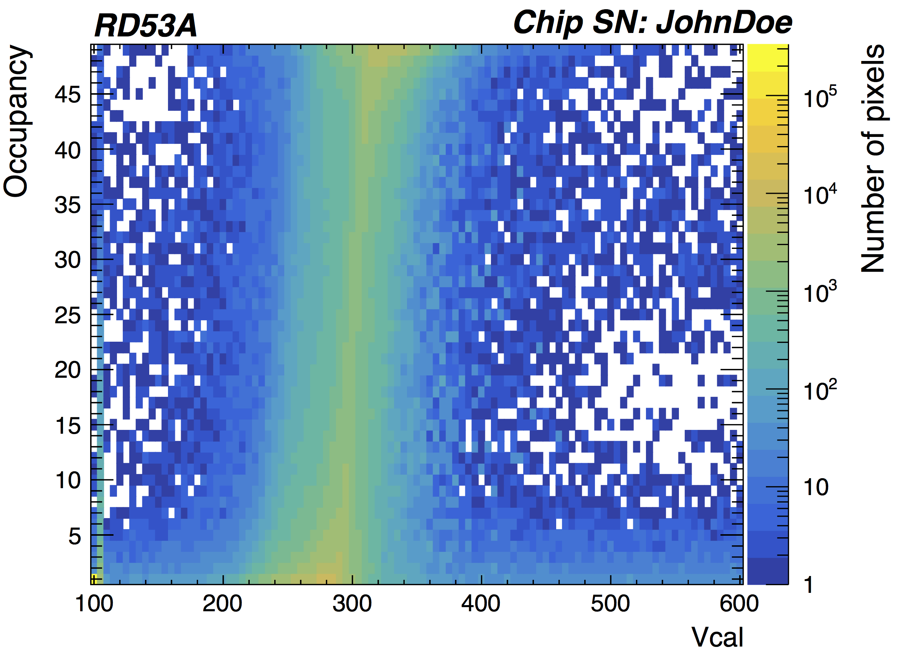
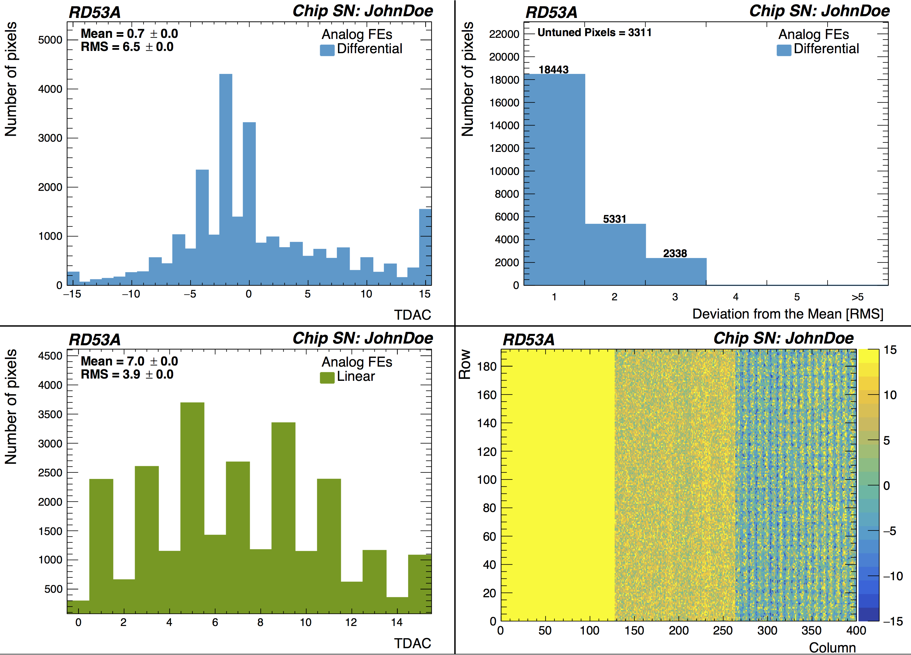
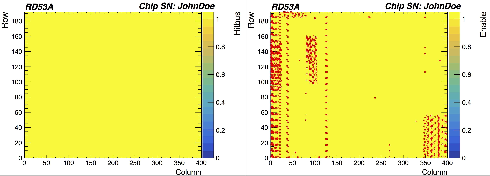
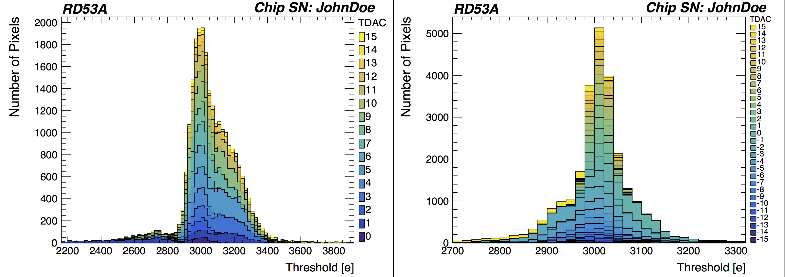
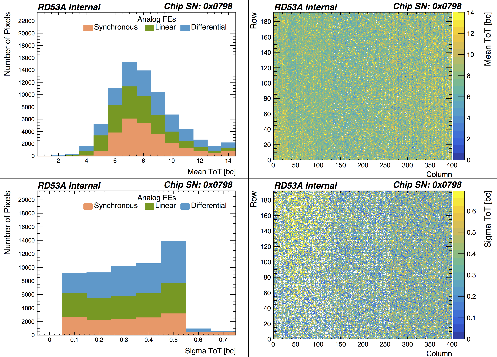
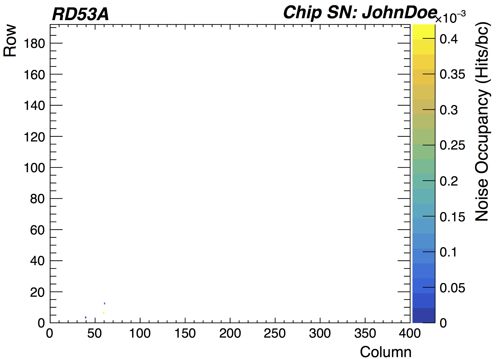

#Root Scripts

Scripts currently just for RD53A. 

Requires root6.

##Compile with Makefile

In order to use the scripts, you must first compile using make.
Note: You must do make in Yarr/src/scripts. These do not compile when using make in Yarr/src. 

```bash
$ cd Yarr/src/scripts
$ make
[Compiling] plotWithRoot_Scurve.o
[Linking] plotWithRoot_Scurve
[Compiling] plotWithRoot.o
[Linking] plotWithRoot
[Compiling] plotWithRoot_ToT.o
[Linking] plotWithRoot_ToT
[Compiling] plotWithRoot_json.o
[Linking] plotWithRoot_json
[Compiling] plotWithRoot_ThresholdTDAC.o
[Linking] plotWithRoot_ThresholdTDAC
[Compiling] plotWithRoot_Threshold.o
[Linking] plotWithRoot_Threshold
[Compiling] plotWithRoot_Occupancy.o
[Linking] plotWithRoot_Occupancy
[Compiling] plotWithRoot_Noise.o
[Linking] plotWithRoot_Noise
[Compiling] plotWithRoot_NoiseMap.o
[Linking] plotWithRoot_NoiseMap
```

##Scripts

###Occupancy Plots

Plots 1D histograms showing [Number of Pixels] versus [Range of Occupancy Values (%)] for each of the RD53A front ends (FEs) as well as a stacked histogram.
Uses OccupancyMap.dat files.
Currently the script assumes the targeted occupancy value is 100 injections.

```bash
$ ./plotWithRoot_Occupancy path/to/directory file_ext
```

Examples of all the Occupancy plots given below: 




###Threshold Plots

Plots and fits 1D histograms showing [Number of Pixels] versus [Threshold Value (e)] for each of the RD53A FEs and one stacked plot; the combined plot is used to get the fit for the stacked plot.
Plots 1D histograms (regular and normalized) showing [Number of Pixels] versus [Range of Threshold Values (deviation from the Gaussian Mean or histogram RMS)] for each of the RD53A FEs and one stacked plot.
Plots 2D histogram showing the [Threshold Value (e)] for each pixel.
Uses ThresholdMap.dat files. To use the good Differential pixel mask, set goodDiff_On to 1.
Optional settings to change the xrange and number of bins.

```bash
$ ./plotWithRoot_Threshold path/to/directory file_ext goodDiff_On xlow (optional) xhigh(optional) xbins(optional)
```

Examples of some of the Threshold plots given below: 




###NoiseMap Plots

Plots 1D histograms showing [Number of Pixels] versus [Noise (e)] for each of the RD53A FEs and one stacked plot.
Plots 1D histograms (regular and normalized) showing [Number of Pixels] versus [Range of Noise (deviation from the Gaussian Mean or histogram RMS)] for each of the RD53A FEs and one stacked plot.
Plots 2D histogram showing the [Noise (e)] for each pixel.
Uses NoiseMap.dat files. To use the good Differential pixel mask, set goodDiff_On to 1.

```bash
$ ./plotWithRoot_NoiseMap path/to/directory file_ext goodDiff_On
```

Examples of some of the Noise plots given below: 





###S-Curve Plot

Plots the S-curve for all pixels.
Uses sCurve.dat files.

```bash
$ ./plotWithRoot_Scurve path/to/directory file_ext
```

Example S-curve plot given below:



###TDAC, Hitbus, and EnableMask Plots

Plots 1D histograms showing [Number of Pixels] versus [TDAC setting] for the linear and differential RD53A FEs.
Plots 1D histograms showing [Number of Pixels] versus [Range of TDAC settings (deviation from the mean)] for each of the RD53A FEs.
Plots 2D histograms showing the [TDAC setting], [Hitbus], and [EnableMask] for each pixel. For the [Hitbus] and [EnableMask] plots, circle the pixels with values of 0, if the number of pixels of value 0 are less than 25% of the total pixels.
Uses rd53a\*.json files.

```bash
$ ./plotWithRoot_json path/to/directory file_ext
```

Examples of some of the json plots given below: 




###Threshold/TDAC plots

Plots a stacked histogram for all thresholds and their corresponding TDACs.
Uses .json.after and ThresholdMap.dat files; this program currently uses the first of each file found.

```bash
$ ./plotWithRoot_ThresholdTDAC path/to/directory file_ext
```

Examples of some of the ThresholdTDAC plots given below: 



###ToT Plots

Plots 1D histograms showing [Number of Pixels] vs [Mean ToT (bc)] and [Sigma ToT (bc)] and one stacked plot.
Plots 2D histograms showing the [Mean ToT (bc)] and [Sigma ToT (bc)] for each pixel.
Uses ToTMap0.dat files. To use good Differential pixel mask, set goodDiff_On to 1.

```bash
$ ./plotWithRoot_ToT path/to/directory file_ext goodDiff_On
```

Examples of some of the ToT plots given below:


###Noise Occupancy Plot

Plots the [Noise Occupancy (hits/bc)] for each pixel. If less than 25% of the pixels have values of 0, circle those pixels. 
Uses NoiseOccupancy.dat files.

```bash
$ ./plotWithRoot_Noise path/to/directory file_ext
```

Example of a Noise Occupancy plot given below:



