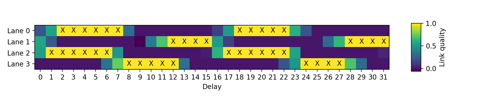
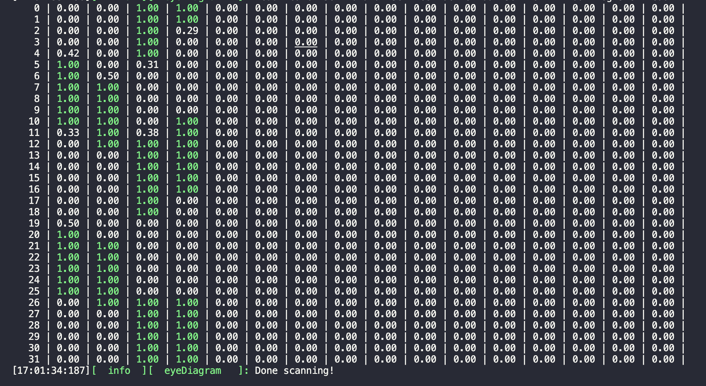

# Guide for updating to 1.28 Gbps readout

## Introduction 

Firmware after release 1.4.0 includes some major changes to the testing workflow. The latest firmware allows to run at a readout speed of 1.28 Gbps, which now is the baseline, replacing the previous baseline readout speed of 640Mbps. Specifically, the firmware includes an update to the deserialiser, which allows the deserialiser sampling delay to be set manually to ensure good data transmission. In order to find the ideal delay setting, an eye diagram has to be run. 

The eye diagram counts the number of non-idle frames over a certain time period, and compares it to the number of expected non-idle frames from the number of service blocks. The link quality is then determined as:

```
LinkQuality = log( 1/(|count  - expected_count|/count))/13.0
```

This link quality factor goes to infinity when the measured count and expected count of non-idle frames match exactly, in which case the link quality factor is set to 1. The eye diagram measures the link quality factor for each deserialiser delay settings. An example of an eye diagram for 4 lanes can be seen here: 



The yellow boxes with the “X” indicate good data transmission (over the finite duration of the test). The eye diagram then determines the best deserialiser delay setting by choosing the largest good region and choosing a delay value in the center of the good region. The eye diagram script will then store the best delay value in the spec card controller configuration file.

## Guide for switching to 1.28 Gbps

Following the instructions in [FPGA Setup](pcie.md), download the latest version of the firmware using the [flash.sh](http://yarr.web.cern.ch/yarr/firmware/flash.sh) script (don't forget to source vivado). 

```bash
 wget --backups=1 http://yarr.web.cern.ch/yarr/firmware/flash.sh
 <text>
 ./flash.sh
```

The script will ask you several questions, asking to specify readout speed and and channel configuration. Select 1280 Mbps as the readout speed, and the channel configuration based on your use case. For module QC, 16x1 will most likely be the applicable version, for usage with a 1 DP adapter card. For operation of SCCs, the 4x4 firmware can still be applicable. 

After flashing the firmware, reboot the PC and run 
```bash
./bin/specComTest -s <specNum>
```
to ensure firmware has been correctly flashed and you see the firmware version expected in the log. 

Next, the software needs to be updated. Check out the latest tag (`1.4.6` or higher), and recompile. 

Finally, the exisiting chip configs need to be updated to from 640Mbps to 1.28 Gbps. A dedicated script is provided for taking care of this automatically, simply run: 

```bash
python3 scripts/update_config.py -c <connectivity_file>
```

where you provide the module connectivity file is provided as an argument. Now the setup is ready for running scans. Before running any scan on a new module, an eye diagram needs to be run to determine a good deserialiser delay setting. The eye diagram is run as: 

```bash
/bin/eyeDiagram -r configs/controller/specCfg-rd53b-16x1.json -c <connectivity_file>
```

The scan will print the eye diagram in the terminal, with an example shown below, where good delay settings are indicated in green: 



The eye diagram script then saves the best delay settings to the controller config. The eye diagram should find good settings for all of the lanes that are expected based on the setup (i.e. 4 for a working quad). If this is not the case, consult the troubleshooting section below. 

The delay setting will depend on the chip, as well as specifics of the setup, such as FPGA, cable lengths, etc, so it has to be run every time something changes in the setup, and specifically each time a new module is plugged in. 

In summary, there are four steps to switching to 1.28 Gbps: 
1. Flash the new firmware using the `flash.sh` script & reboot the PC
2. Check out the latest software tag (`1.4.6` or above) and recompile 
3. For each module: Update the chip configs using the `scripts/update_config.py`
4. For each module: Before running any other scans, run an eye diagram

## Troubleshooting

- I see `0` for all lanes and delay settings in the eye diagram 
    - Check that the chip configs have been updated correctly by the script (an indicator could be `CdrClkSel`, which should be 0)

- I see `0` for some lanes, and good data transmission on others 
    - Check that all chips are enables in the connectivity config. The eye diagram configures the chip, which also set the clock speed
    - Check that the data adapter cable is plugged in well on the adapter card. If in doubt, unplug and replug. 

- I see some non-zero values in the eye diagram, but no good delay settings (i.e. '1's)
    - Check that the chip configs have been updated correctly by the script (specifically `CmlBias0: 800`, `CmlBias1: 400`, `MonitorV: 32`, `SerEnTap: 1`, `SerInvTap: 1`) 
    - Check that the data adapter cable is plugged in well on the adapter card. If in doubt, unplug and replug. 
    - Check that with the 640 Mbps of the firmware (which also has the eye diagram), you get some good settings - if not, this likely indicates an underlying issue in the setup (e.g. chip powering)
    - If possible, try shorter DisplayPort cables
